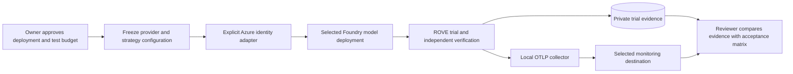

# Live provider and Azure validation specification

Status: **specified; not executed**. The local completion work makes no provider
calls, provisions no cloud resources, and does not claim Azure authentication,
hosted monitoring, model quality or hardware compatibility. Local SDK tests use
synthetic model transport. This document defines the evidence required for a
separate, explicitly authorized live validation run.

## Personas and decision

A robotics developer needs a compatible image/model/tool path on the customer's
tasks. An evaluation lead needs independently graded evidence and honest unknowns.
A platform administrator needs bounded execution, credential isolation and trace
delivery into the organization's monitoring environment. A live validation should
answer those questions before advertising an integration as supported.

## Prerequisites and proposed profile

Record the approved subscription/project, deployment endpoint and name, region,
model revision exposed by the provider, wire protocol, SDK/CLI versions, image/tool
support, rate limits, permitted data classification and a maximum request/spend
budget. A deployment name is not a frozen weight archive. Use a synthetic public
image initially; customer observations require their explicit data authorization.

Azure SDK/BYOM access must use an explicit Entra identity integration: local
`DefaultAzureCredential` for development and a selected `ManagedIdentityCredential`
for an Azure-hosted workload. Grant the least resource-scoped inference role for
the chosen service. Pass a short-lived bearer token provider through the SDK;
never store token values in YAML, snapshots, evidence exports or browser state.
Test token renewal and tenant/audience restrictions. This identity adapter is a
future implementation item; the current generic Copilot adapter's explicit
API-key configuration is not evidence that Azure managed identity works.

Select and validate the provider shape for that deployment. The SDK's official
guide distinguishes Azure's OpenAI-compatible `/openai/v1/` route and native Azure
provider configuration. Choose `completions` or `responses` according to the actual
endpoint; do not infer interchangeability from a model name.
[SDK BYOK guide](https://docs.github.com/en/copilot/how-tos/copilot-sdk/auth/byok).

## Acceptance matrix

| Scenario | Required observation | Failure treatment |
| --- | --- | --- |
| Image and structured output | Actual approved image reaches provider; result validates the ROVE stage schema | Unsupported or invalid output, never synthetic fallback |
| Host tool | Provider requests one bounded read tool; exact arguments validate; result returns to model | Deny unknown tools/arguments; retain error evidence |
| Role isolation | Candidate cannot access grader labels, review data or grader tools; each role has a fresh session | Block compatibility claim if isolation fails |
| Repetition reset | Distinct trial/session/process identities; explicit environment reset evidence where required | Mark reset uncertainty; exclude invalid trials from success claims |
| Usage and cost | Actual per-call usage, provider request ID if available, pricing units/version and budget enforcement | Keep unavailable tokens/cost unknown; multiplier is not currency |
| Cancellation and deadline | Cancel during generation and during a tool; verify runtime exits and journal terminal state | No success outcome after incomplete work; hardware stop separately attested |
| Provider error | Exercise denied identity, invalid deployment, timeout and throttling within approved budget | Preserve failure class and bounded cleanup; redact payloads |
| Monitoring ancestry | Actual trial → stage → native SDK → named host tool identity appears in selected destination | Record missing spans/export gaps without altering trial outcome |
| Monitoring outage | Collector/network failure and recovery leave local evidence and history usable | No evaluation replay or duplicate usage; document delivery loss |
| Baseline and ablation | Same frozen cases/contract/environment; change one candidate component intentionally | Reject incompatible comparisons; disclose all component differences |

For App Insights/Log Analytics or Grafana, select the actual collector distribution,
exporter, authentication, workspace/tenant, retention, query access and redaction
policy. Validate the downstream stored spans by trace ID; HTTP acknowledgement
alone is insufficient. Keep the evaluation database and managed assets independent
of monitoring sampling/retention. Fabric/Delta export requires its own schema and
round-trip validation; this specification does not claim that integration.

## Evidence and release gate

Save a private validation bundle with redacted configuration fingerprint, explicit
provider/model identity, ROVE revision, dependency versions, case/contract/trial
IDs, lifecycle and usage records, source clock attribution, native/tool ancestry,
collector configuration, destination queries, failure-case results and a reviewer
decision. Do not publish credentials, customer images or unrestricted traces.

Report compatibility per tested provider/deployment/protocol and evidence mode.
A VLM/agent output assessment does not establish physical completion. Recorded
episodes can be regraded; fresh VLA/robot performance requires executed actions,
environment reset, independent measurements and appropriate hardware safeguards.
The validation owner signs off only after all applicable matrix rows pass or each
unsupported capability is clearly excluded from the integration claim.
