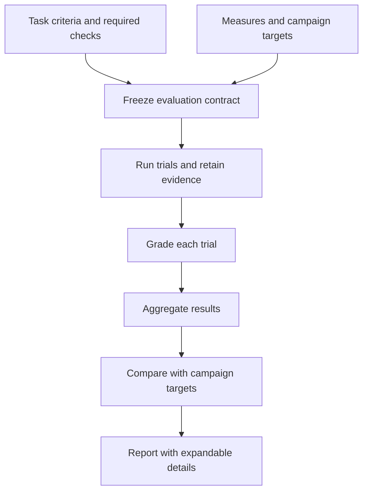

# Define success before running a campaign

**Status: proposed product behavior.** Configured verification and pass@k/pass^k
reports exist today. The shared metric configuration, setup controls, campaign
target assessment and collapsible report details described below are not implemented.

ROVE should let a robotics developer state what counts as a successful task, what
evidence will establish it, and what results a campaign should achieve before
starting trials. These are different decisions: a campaign target must never
rewrite individual trial verdicts.

## Two levels of success

| Level | Definition | Example |
| --- | --- | --- |
| Task outcome | Configured task evaluator plus required checks, producing pass, fail or unknown | Object is in the target region; measured contact force stays within the declared limit |
| Campaign target | A declared requirement on an aggregate result and its evidence coverage | The measured repeatability estimate reaches the chosen target with all planned verdicts resolved |

The existing [verification configuration](../VERIFICATION.md) already defines the
task evaluator, constraint/diagnostic roles, required checks and stage deadlines.
A required constraint failure vetoes task success. Unresolved required evidence
remains unknown; diagnostic plausibility does not establish task completion.
ROVE should reuse this configuration rather than introduce a second grading system.

The proposed campaign target result is **met**, **not met** or **insufficient
evidence**. A missing required metric or unmet coverage requirement yields
insufficient evidence. Changing a campaign target produces a new assessment
revision; it does not turn failed trials into successes. This is an assessment of
the collected sample, not a deployment certification.

## Setup in configuration and the UI

Both interfaces should read and write the same validated, versioned contract:

- Case/dataset revision, task evaluator, required checks and their versions.
- Selected measures, k values, aggregation and missing-evidence rules.
- Observable inputs, unit, counting population, reset conditions, episode horizon
  and observation window; separate episode completion time from processing time.
- Optional campaign targets, their operators/values and required coverage.

Before **Run campaign**, show a compact **Success and measures** summary. Each
selected measure states what it answers, its evidence requirements and whether it
is ready, depends on trial outputs, or is unavailable with a specific reason.
For example, pass^5 is unavailable with only three planned repeats; completion
time requires a declared episode timing source. Missing data must not become zero.
Invalid definitions cannot start a campaign. Optional unavailable measures can
remain visible without blocking a diagnostic run.

Freeze the validated contract before execution and include its identity in the
report. An old report must use that saved definition rather than current UI defaults.
See [concepts](concepts.md), [evaluation workflows](evaluation-workflows.md) and
[trial lineage](../architecture/ADR-018-trial-lineage-and-snapshots.md).

## Measures that answer robotics questions

Choose measures for the customer's task, regardless of whether a strategy uses a
VLA or another agent. Scene-answer correctness, plan acceptance under a rubric and
executed robot-goal completion are different success contracts. An agent-only
task should not require force sensing or physical completion time; a plausible
plan should not be labeled a completed physical task.

| Measure | Question | Boundary |
| --- | --- | --- |
| Task success rate / pass@1 | How often did this configuration meet the declared task criteria? | The claim depends on the evaluator and associated outcome evidence |
| pass^k | How consistently could all k attempts succeed? | Repeated-trial estimate, not a guarantee of a deployment streak |
| pass@k | How often could at least one of k attempts succeed? | Secondary capability measure; does not establish an implemented retry/recovery policy |
| Constraint outcomes | Which required limits were violated or unmeasured? | Show violations and unknowns separately |
| Episode completion time | How long did successful task completion take? | Requires supplied timing evidence and an explicit measured subset |
| Autonomous completion | Which tasks completed without intervention? | Requires outcome evidence and complete intervention records; absent records are unknown |
| Task progress | Which declared milestones were reached? | Requires criterion-specific evidence; plan length and generated steps are not progress |
| Recovery | Did the system recover after a declared perturbation? | Requires trigger, eligible episode count, recovery criterion and time horizon |

Headline task completion, repeatability and constraint outcomes, then show timing,
autonomy, progress or recovery when the contract supplies their evidence. This
does not require implementing every measure in the first slice. Stage/tool errors
and timeouts are diagnostics; cost appears only when metered. Neither missing
intervention logs nor a generic retry count demonstrates autonomous recovery.

Keep evidence origin and assessment method explicit: physical, simulated or
synthetic evidence must not be confused with measured, estimated, human-reviewed
or model-judged assessments. Unknown provenance remains unknown. A high SME rating
of a plan is human judgment, not observed robot success. Replaying fixed outcome
observations can evaluate a grader but cannot show improvement from a new policy.

A baseline comparison should lead with changes in the declared customer outcome
and the affected cases, with component changes and traces supporting that result.

Precision, recall and F1 are outside this feature. Revisit them only for a concrete
labeled classification problem; task success rate is not precision.

## Existing pass metric definitions

For one case and one fixed strategy, `n` is the planned trial count and `c` is the
number of observed successes. Current code calls these concrete cases “tasks.”

| Metric | Current estimator |
| --- | --- |
| pass@k | `1 - C(n-c, k) / C(n, k)` |
| pass^k | `C(c, k) / C(n, k)` |

These sample k attempts without replacement; pass^k is not calculated as
`(c/n)^k`. Both reduce to `c/n` at k=1. Campaign summaries give equal weight to
each case rather than pooling trials across configurations. Cross-configuration
any-success coverage is a separate hindsight measure with its total attempt budget.

If `u` trials are unresolved, the point estimate is unavailable; current bounds
use `c` and `c+u` successes while keeping planned `n`. Pending work, errors and
timeouts stay in this uncertainty, rather than disappearing from the denominator.
Values with `k > n` are unavailable. These bounds are not confidence intervals.

Current case-level pass@1 reports also include a 95% Wilson interval when all
verdicts are resolved, assuming independent Bernoulli attempts. Correlated episodes,
unsupported seeds and imperfect judges limit that interpretation. Do not add
confidence intervals to higher-k curves or campaign deltas without a justified
sampling procedure. See [implemented scoring](../BENCHMARKS.md).

## Report and acceptance criteria

Keep the summary readable: outcome counts, coverage, pass curves, constraint
violations and available task measurements. Proposed expandable **How this was
measured** details should expose definitions/formulas, aggregation, planned and
resolved counts, unknown reasons, evidence quality, units/time windows, contract
and grader versions, selected label/review revisions and links to supporting
trial records. Details must be keyboard accessible and export with the report.

Acceptance requires that configuration and UI produce the same frozen contract;
missing evidence stays visible; changing an aggregate target preserves trial
grades; and a baseline comparison identifies changed criteria or reference labels.
Re-grading stored evidence creates a new grading revision and retains the original.
If the new criteria need uncaptured evidence, the result remains unknown. See
[SME-reviewed datasets](../architecture/ADR-020-sme-reviewed-datasets.md) and
[ADR-021](../architecture/ADR-021-campaign-success-and-reporting.md).
