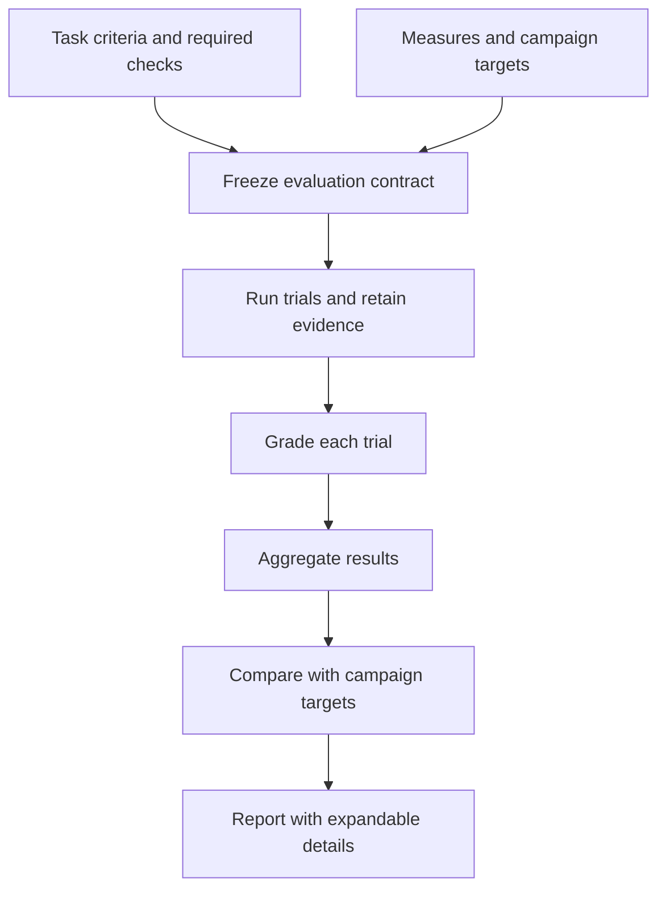

# Define success before running a campaign

**Status: implemented locally for the supported evidence contract.** Configured
verification, pass@k/pass^k, frozen success contracts, SME/frozen-label assessment,
typed episode measures and aggregate targets share the local workflow. Hardware
and live-provider validation are not implied.

ROVE lets a robotics developer state what counts as a successful task, what
evidence will establish it, and what results a campaign should achieve before
starting trials. These are different decisions: a campaign target must never
rewrite individual trial verdicts.

## Two levels of success

| Level | Definition | Example |
| --- | --- | --- |
| Task outcome | Configured task evaluator plus required checks, producing pass, fail or unknown | Object is in the target region; measured contact force stays within the declared limit |
| Campaign target | A declared requirement on a supported aggregate and its evidence coverage | Task success reaches 60%, with evidence for all planned attempts |

The existing [verification configuration](../VERIFICATION.md) already defines the
task evaluator, constraint/diagnostic roles, required checks and stage deadlines.
A required constraint failure vetoes task success. Unresolved required evidence
remains unknown; diagnostic plausibility does not establish task completion.
ROVE should reuse this configuration rather than introduce a second grading system.

The campaign target result is **met**, **not met** or **unknown**. A missing metric,
empty eligible denominator or incomplete planned-trial evidence yields unknown.
Targets freeze `metric`, `operator` (`gte`/`lte`), `threshold` and `unit`; changing
one creates a new success-contract revision without rewriting recorded trial
grades. This assesses the collected sample, not deployment certification. Current
targets support task success, pipeline latency, episode completion time, autonomous
completion, recovery and constraint outcomes. Higher-k curves remain reported
estimates, not an additional target type.

## Setup in configuration and the UI

The implemented Cases workflow saves a contract with assessment scope, evidence
mode, required criteria and selected metrics. Automated criteria bind to configured
verification; human criteria require per-output ratings. Preview marks measures
available, conditional, awaiting review or unavailable, explains k values exceeding repetitions,
and rejects unsupported completion claims from image/model outputs alone.

Static episode records support regrading and never establish fresh candidate
execution. Versioned recordings require explicit identities, units, frame, source
clock and available samples/assets. The deterministic synthetic adapter instead
executes the current candidate trajectory and records its resulting state. The
configured episode verifier supplies completion, constraint, intervention and
recovery measurements with synthetic or supplied observed provenance. Explicit
contract bindings can supply selected frozen SME labels to local graders while
keeping candidate inputs separate. See [robotics evidence](robotics-evidence.md)
for exact schemas and supported bindings. The API/UI share these contracts; the
example runner demonstrates programmatic setup, without adding a dedicated
contract-file CLI.

The API and UI use the same validated, versioned contract:

- Case/dataset revision, task evaluator, required checks and their versions.
- Selected measures, k values, aggregation and missing-evidence rules.
- Observable inputs, unit, counting population, reset conditions, episode horizon
  and observation window; separate episode completion time from processing time.
- Optional campaign targets, their operators/values and required coverage.

Before **Run campaign**, show a compact **Success and measures** summary. Each
selected measure states what it answers, its evidence requirements and whether it
is ready, depends on trial outputs, or is unavailable with a specific reason.
For example, pass^5 is unavailable with only three planned repeats; completion
time requires a declared episode timing source. Missing data must not become zero.
Invalid definitions cannot start a campaign. Optional unavailable measures can
remain visible without blocking a diagnostic run.

Freeze the validated contract before execution and include its identity in the
report. An old report must use that saved definition rather than current UI defaults.
See [concepts](concepts.md), [evaluation workflows](evaluation-workflows.md) and
[trial lineage](../architecture/ADR-018-trial-lineage-and-snapshots.md).

## Measures that answer robotics questions

Choose measures for the customer's task, regardless of whether a strategy uses a
VLA or another agent. Scene-answer correctness, plan acceptance under a rubric and
executed robot-goal completion are different success contracts. An agent-only
task should not require force sensing or physical completion time; a plausible
plan should not be labeled a completed physical task.

| Measure | Question | Boundary |
| --- | --- | --- |
| Task success rate / pass@1 | How often did this configuration meet the declared task criteria? | The claim depends on the evaluator and associated outcome evidence |
| pass^k | How consistently could all k attempts succeed? | Repeated-trial estimate, not a guarantee of a deployment streak |
| pass@k | How often could at least one of k attempts succeed? | Secondary capability measure; does not establish an implemented retry/recovery policy |
| Constraint outcomes | Which required limits were violated or unmeasured? | Show violations and unknowns separately |
| Episode completion time | How long did successful task completion take? | Requires supplied timing evidence and an explicit measured subset |
| Autonomous completion | Which tasks completed without intervention? | Requires outcome evidence and complete intervention records; absent records are unknown |
| Task progress | Which declared milestones were reached? | Requires criterion-specific evidence; plan length and generated steps are not progress |
| Recovery | Did the system recover after a declared perturbation? | Requires trigger, eligible episode count, recovery criterion and time horizon |

Headline task completion, repeatability and constraint outcomes, then show timing,
autonomy and recovery where evidence supports them. Criterion-specific task progress
is not a supported aggregate in this slice and is never inferred from generated
steps. Stage/tool errors and timeouts are diagnostics; cost appears only when
metered. Neither missing intervention logs nor generic retries demonstrates recovery.

Implemented episode completion time is the mean among successful episodes with
explicit durations. Autonomous completion divides successful zero-intervention
episodes by the eligible measured episodes. Recovery divides recovered episodes
by explicit opportunities; zero opportunities yields unavailable. Constraint
outcomes count episodes with zero recorded violations. Pipeline latency uses p95
in milliseconds, with its sample count and no ratio numerator. `robotics-metrics-v1`
results expose units, aggregation, denominator, known/unknown planned trials,
coverage and evidence quality. Full planned evidence coverage is required before
returning a target-meeting point value; missing data does not become zero.

Keep evidence origin and assessment method explicit: physical, simulated or
synthetic evidence must not be confused with measured, estimated, human-reviewed
or model-judged assessments. Unknown provenance remains unknown. A high SME rating
of a plan is human judgment, not observed robot success. Replaying fixed outcome
observations can evaluate a grader but cannot show improvement from a new policy.

A baseline comparison should lead with changes in the declared customer outcome
and the affected cases, with component changes and traces supporting that result.
Each aggregate should drill down to the contributing trials and each measurement
to its exact grader/check and evidence. The inspector presents bounded recording selections and producer-clock lanes
alongside events; expose missing samples and alignment uncertainty. Only a shared
source clock establishes a common timeline origin; separate clock lanes and paired
traces do not manufacture cross-process synchronization. Keep scalar summaries linked to their source windows and aggregation
rules. See [traces and measurements](traces-and-measurements.md).

Precision, recall and F1 are outside this feature. Revisit them only for a concrete
labeled classification problem; task success rate is not precision.

## Existing pass metric definitions

For one case and one fixed strategy, `n` is the planned trial count and `c` is the
number of observed successes. Current code calls these concrete cases “tasks.”

| Metric | Current estimator |
| --- | --- |
| pass@k | `1 - C(n-c, k) / C(n, k)` |
| pass^k | `C(c, k) / C(n, k)` |

These sample k attempts without replacement; pass^k is not calculated as
`(c/n)^k`. Both reduce to `c/n` at k=1. Campaign summaries give equal weight to
each case rather than pooling trials across configurations. Cross-configuration
any-success coverage is a separate hindsight measure with its total attempt budget.

If `u` trials are unresolved, the point estimate is unavailable; current bounds
use `c` and `c+u` successes while keeping planned `n`. Pending work, errors and
timeouts stay in this uncertainty, rather than disappearing from the denominator.
Values with `k > n` are unavailable. These bounds are not confidence intervals.

Current case-level pass@1 reports also include a 95% Wilson interval when all
verdicts are resolved, assuming independent Bernoulli attempts. Correlated episodes,
unsupported seeds and imperfect judges limit that interpretation. Do not add
confidence intervals to higher-k curves or campaign deltas without a justified
sampling procedure. See [implemented scoring](../BENCHMARKS.md).

## Report and acceptance criteria

Keep the summary readable: outcome counts, coverage, pass curves, constraint
violations and available task measurements. Expandable report details expose
definitions/formulas, aggregation, planned and
resolved counts, unknown reasons, evidence quality, units/time windows, contract
and grader versions, selected label/review revisions and links to supporting
trial records. HTML and JSON include aggregate robotics measures and campaign
targets. CSV stays one row per trial with assessment lineage; campaign aggregates
are not duplicated into each row. Details must remain keyboard accessible.
The trial inspector must preserve the difference between model-generated actions,
dispatched calls and observed execution. Usage is available only when recorded;
pricing-derived cost needs its rate/version and an estimated label. A timeline
supports investigation, but does not by itself prove which component caused failure.

Acceptance requires that configuration and UI produce the same frozen contract;
missing evidence stays visible; changing an aggregate target preserves trial
grades; and a baseline comparison identifies changed criteria or reference labels.
Re-grading stored evidence creates a new grading revision and retains the original.
If the new criteria need uncaptured evidence, the result remains unknown. See
[SME-reviewed datasets](../architecture/ADR-020-sme-reviewed-datasets.md) and
[ADR-021](../architecture/ADR-021-campaign-success-and-reporting.md).
