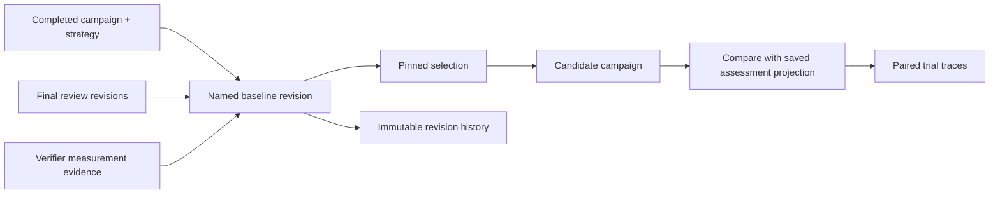
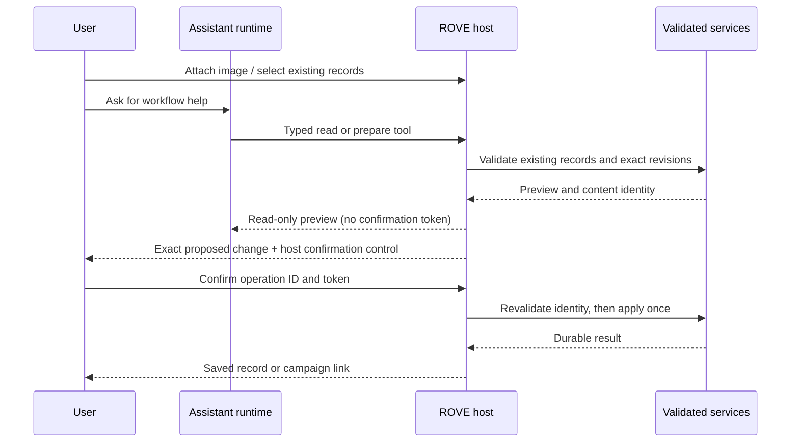

# Named baselines and confirmed workflow assistance

ROVE evaluates robotics agent pipelines on your task. A robotics developer needs a
stable reference for a change; an evaluation lead needs to know which human review
revisions contributed to that reference. A platform administrator needs the assistant
to use the same services and permissions as the visible workflow.

## A baseline is a reference, not another run

The Cases workspace can name and pin a completed campaign strategy. Its baseline
revision records the campaign/configuration hash, case and dataset identities,
contract, assessed trial outcomes, verifier measurements and assessment revision set.
Later SME ratings do not rewrite these saved outcomes. Pinning does not certify the
agent: an incomplete baseline still contains unknown outcomes.

Renaming, unpinning or replacing the selected campaign creates a new baseline revision.
An optimistic head check rejects a stale edit. The history selector can inspect an old
revision; saving from that stale revision requires refreshing the current head.
A candidate comparison copies the exact selected baseline revision identity. It retains
existing case/environment/contract comparability checks, and links the paired trials
to their trace lanes. A difference in outcomes is not proof of causation.

## Attach evidence without inventing a measurement

The case editor uploads bounded auxiliary files through the managed asset API. Users
supply the reference kind, source clock, coordinate frame, field units and optional
half-open selection range. The generated `recorded_evidence.evidence_refs` entry stays
in the unsaved case until the user saves it. Whole-file is the default; no clock,
physical outcome or evidence quality is guessed. Sample/frame/time ranges require an
indexed JSON recording, and typed trajectory/state metadata must match its envelope.

## Assistant prepares; the host confirms

The optional assistant can inspect cases, contracts, final reviews, datasets, baselines,
trials and comparisons. Its typed tools prepare these operations:

- Import a case using a managed image explicitly attached by the user.
- Create a new case revision against the exact current head.
- Create an immutable success contract, optionally referring to a prior contract.
- Freeze exact case membership using existing finalized review IDs.
- Save a named baseline revision.
- Launch a campaign or a comparable candidate ablation.

The assistant cannot write SME judgments or reusable labels. Imports reject generated
private reference data and recorded episodes; use the case editor to supply those
explicitly. Assistant revisions preserve existing private references and recorded
evidence. The candidate context still rejects private labels. Contract annotation
bindings pass selected frozen review fields only to their configured verifier.

The user sees the exact proposed request, validated preview, measurement expectations,
and immutable identities before selecting the operation-specific confirmation button.
No model-visible result contains the host confirmation token. A model-generated answer
cannot manufacture a proposal, approval, evidence link or alternative write operation.

## Persistence and failure behavior

SQLite stores named baseline heads and immutable revisions in the shared private trial
journal. Workflow mutation IDs and result IDs are written atomically with case imports,
case revisions and dataset freezes. Success contracts are content addressed. Campaigns
and baseline writes also deduplicate operation IDs. A lost response after a committed
write resumes the original operation rather than creating a duplicate.

Prepared authorizations expire after ten minutes or a server restart. A changed head,
review preview, configuration or baseline capture requires another preview. Committed
records remain available through their normal history APIs. There is no live-provider
validation claim: acceptance tests use real local services and a controlled fake runtime;
the UI journey uses a simulated API. Provider/Azure setup remains a separate documented
validation task, with no credentials or network calls required for these tests.

## Interfaces

`GET/POST /api/baselines`, `GET/PATCH /api/baselines/{id}` and
`GET /api/baselines/{id}/revisions` manage references. Writes carry `operation_id`;
updates also carry `expected_head_revision_id`. Baseline IDs identify current heads;
revision IDs identify immutable saved records.

`POST /api/assistant/ask` accepts bounded text and selected record identities, including
explicitly attached `asset_sha256s`. It returns plain text, host-created evidence links
and prepared operations. `POST /api/assistant/confirm` accepts only the operation ID,
host token and literal `confirmed: true`; the caller cannot override the saved request.
All controls continue to work directly when the optional assistant is unconfigured.
