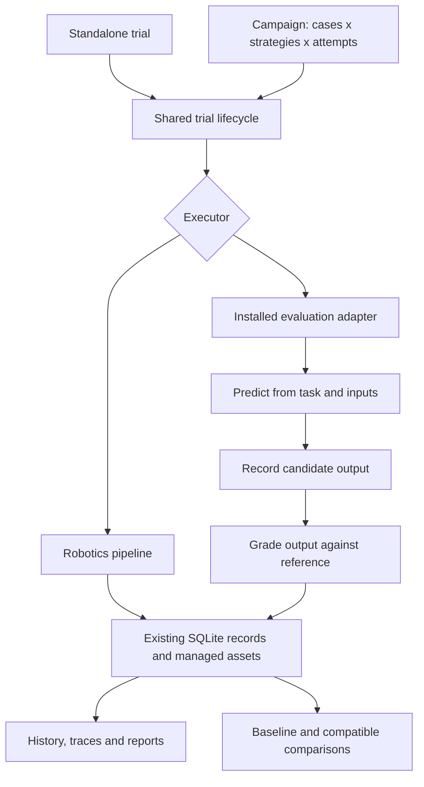

# Reuse trials and campaigns across evaluation domains

**Status:** Implemented locally; release validation is tracked with the change.
**Decision:** [ADR-036](../architecture/ADR-036-reusable-evaluation-core.md).

ROVE's recorded trials, campaigns, comparisons and reports can serve evaluations
that do not have an image, robot description or robotics pipeline. This change
separates those shared services from candidate execution and grading. The existing
robotics implementation remains the default executor.

The first non-robotics example compares two text transformations. It demonstrates
reuse of the real execution and storage lifecycle; it is not an LLM benchmark.

## Who this helps

| Persona | Job | Result from this change |
| --- | --- | --- |
| Robotics researcher or ML engineer | Keep evaluating configured robotics strategies while introducing another execution system | Existing robotics inputs, pipeline stages and recorded evidence remain supported |
| Evaluation engineer | Compare candidates on structured cases without inventing images or robotics stages | A trusted installed adapter supplies prediction and grading; existing trial and campaign services record the results |
| Platform / AI infrastructure team | Automate evaluations and inspect their evidence | CLI execution, saved reports and browser history share the existing local stores |

## One lifecycle, different executors



A **case** supplies a task and structured inputs, with an optional private reference.
A **strategy** supplies the candidate's configuration. One execution of a strategy
on a case creates a **trial**. A **campaign** schedules the selected cases,
strategies and attempt seeds and retains their frozen configuration.

The adapter receives candidate inputs first and grades the recorded output
separately. A candidate returning `success: true` does not determine its grade.
Execution status and the grader's `pass`, `fail` or `unknown` verdict remain separate.

## Run the built-in example

Create `case.json` with an input and a reference answer:

```json
{
  "id": "spaces",
  "task": "Normalize the input text",
  "inputs": {"text": " HELLO "},
  "reference": {"expected": "hello"}
}
```

Create `evaluation.yaml` with two candidate configurations:

```yaml
strategies:
  raw:
    mode: identity
  normalized:
    mode: strip_lower
grading: {}
environment: {}
```

Run a standalone comparison:

```bash
rove trial run --executor text-example --input case.json \
  --strategy raw --strategy normalized --config evaluation.yaml
```

This creates two saved trials without creating a campaign. The identity strategy
fails the equality check; the normalized strategy passes. Without `expected`, the
grader reports `unknown`. These are observed text comparison outcomes, not model
quality or robot performance measurements.

For repeated trials, create `campaign.yaml`:

```yaml
name: Text normalization comparison
suite_version: text-v1
revision: "1"
execution: text-example
grading: executor_assessment
strategies: [raw, normalized]
seeds: [1, 2]
ks: [1, 2]
timeout_s: 10
tasks:
  - id: spaces
    task: Normalize the input text
    inputs:
      text: " HELLO "
    reference:
      expected: hello
```

```bash
rove benchmark run campaign.yaml --config evaluation.yaml
```

The two strategies and two seeds produce four trials and HTML, JSON and CSV reports.
The deterministic example ignores its seed; repeating it does not demonstrate
statistical independence or generalization. Existing coverage and pass@k/pass^k
reports must be interpreted within the executor's assessment scope.

## What is available now

| Surface | Supported scope |
| --- | --- |
| Structured case authoring | JSON/YAML documents passed through manifests or the trial CLI |
| Execution | Built-in `text-example` and explicitly installed Python adapters registered under `rove.evaluations` |
| Shared lifecycle | Durable trial IDs, campaign attempts, deadlines, cancellation, resume and saved configuration |
| Evidence | Candidate output, private reference and assessment stored as managed assets; candidate/assessment trace events |
| Inspection | Generic trial history shows inputs, output, assessment, measurements and traces; generic campaign results open the saved report |
| Comparison | Existing baseline and comparison services retain assessment evidence and reject incompatible declared conditions |
| Robotics authoring UI | Existing Cases, strategy catalog and campaign configuration remain robotics-specific |

Generic campaigns cannot yet be authored or improved through the robotics wizard.
Generic trials are not promoted into robotics cases. The browser displays recorded
generic evaluations; CLI/manifests are the authoring path for this release.

## Extension contract and limits

An installed adapter declares a revision and implements `predict` and `grade`.
Prediction receives only case ID, task, inputs, strategy configuration and seed.
Grading receives the candidate output and separate reference and grading settings.
The same trusted adapter supplies both methods; this is an API boundary, not a
sandbox preventing malicious code from accessing the host or retaining state.

Graders name recorded evidence using `candidate.output` and `case.reference`.
Their assessment becomes `assessment.output`. Missing evidence stays unknown;
unsupported evidence references are rejected. Measurement quality distinguishes
observed, estimated, synthetic and unknown values.

Canonical candidate inputs are also stored as a private managed asset, so redacted
fields do not collapse distinct trial identities. Cases and configuration are
bounded JSON documents; large media belongs in assets.
An adapter must interpret any asset references it accepts. Declaring a path or URL
does not automatically import, download or validate an external dataset.

ROVE fingerprints local adapter source and declared evaluation conditions.
The `environment` field records declared conditions; ROVE does not provision or
apply them. Integrations load models in their constructor or methods, inside the
worker deadline, rather than during module import. Remote model versions and
environment identities must be supplied in configuration;
ROVE does not independently resolve or verify them. Conservative comparison checks
can reject a changed adapter even when its author believes the results comparable.

This is preparation for future integrations. It does not run ABC episodes, turn
XDOF demonstrations into executable scenes, deploy Azure workers, export to Fabric
or provide a generic LLM grader. Those integrations need their own tested adapters
and evidence contracts. The current [ABC import](abc-dataset-support.md) retains
its existing observation-import scope.

## Implementation evidence

See the [case/configuration models](../../src/rove/evaluation/models.py),
[adapter protocol](../../src/rove/evaluation/protocols.py),
[execution boundary](../../src/rove/evaluation/executors.py),
[worker](../../src/rove/evaluation/worker.py) and
[shared lifecycle tests](../../tests/test_evaluation_core.py).
The [history tests](../../tests/test_generic_trial_history_ui.cjs) cover generic
display without fabricated robotics stages or robotics-only actions.
