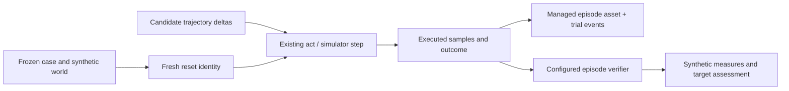
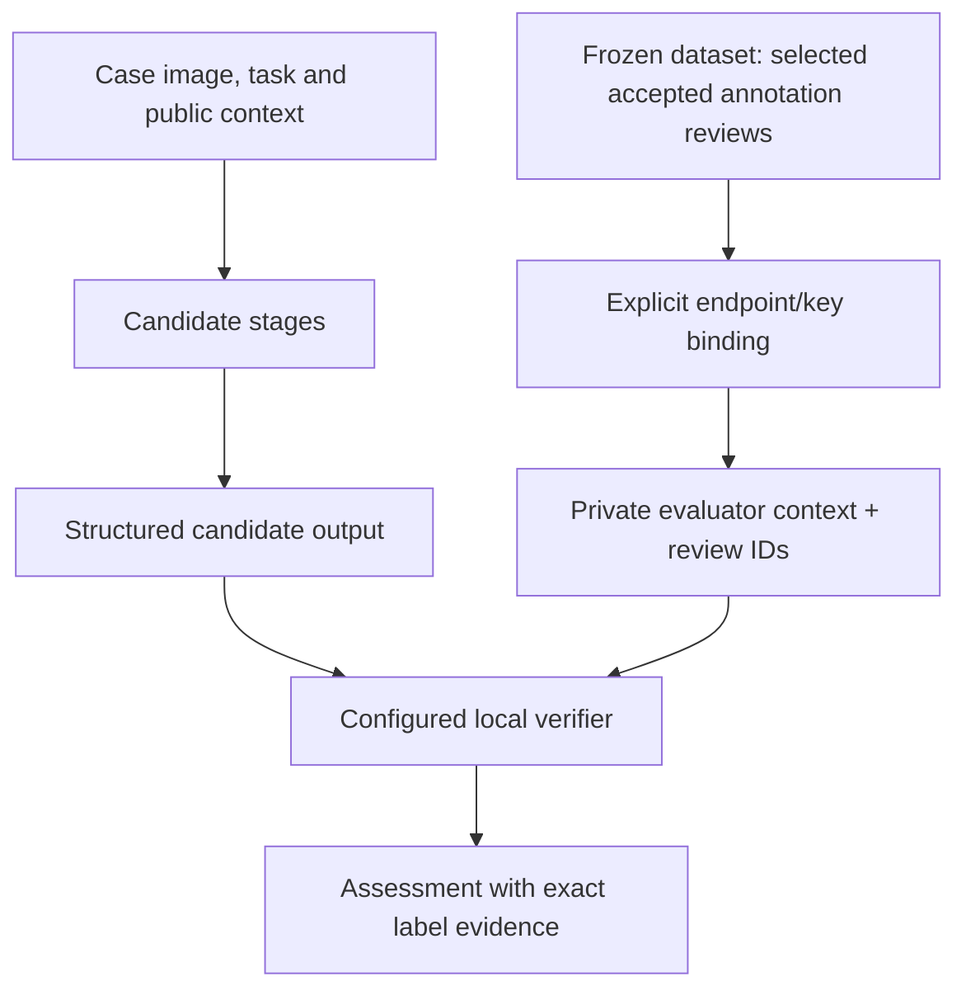

# Robotics evidence, approved labels and campaign targets

ROVE evaluates the configured robotics agent pipeline on the customer's task.
A manipulation engineer needs to distinguish a useful plan from completed motion;
a researcher needs candidate changes to affect the measured environment; a platform
engineer needs to find the recording and exact grader inputs behind a result.
These three workflows use the existing case → trial → assessment hierarchy.

## Action-dependent synthetic episodes

The included `synthetic_sim` adapter implements the existing simulator reset/step
interface. It models one point moving along one world axis. The candidate's
trajectory contains one displacement in metres per action. Reaching a target within
a declared tolerance succeeds unless the trajectory crosses a forbidden interval.
An optional one-time displacement creates a declared recovery opportunity. This is
an idealized deterministic test world, not contact physics or hardware validation.



Set `conditions.synthetic_environment` on a case and select a success contract with
`scope: episode_outcome` and `evidence_mode: synthetic_rollout`. Each selected
strategy needs an act endpoint and `sim: <synthetic_sim endpoint>`. The supported
world fields are `initial_position_m`, `target_position_m`, `tolerance_m`,
`max_delta_m`, `step_duration_s`, `max_steps`, optional `forbidden_interval_m`, and
optional `disturbance_step` / `disturbance_delta_m`. Units and frame are fixed to
metres, seconds and `world_1d`; invalid or undeclared action coordinates are rejected.

Fresh resets have unique identities. Reset failure stops the trial before candidate
execution. Missing, oversized or malformed actions cannot become a successful
rollout. The verifier reads the state produced by the current candidate; a supplied
old recording cannot substitute for this execution. The
[example runner](../../examples/robotics/README.md) executes ordinary campaign
workers without model credentials.

## Versioned episode recordings

`recorded_evidence` accepts a version-1 episode envelope with explicit `origin`,
`quality`, `case_id`, `reset_id`, `producing_system`, `source_clock_id`, `frame` and
`units`. Time uses `s` and position uses `m`. Optional `task_completed`,
`constraint_violations`, `completion_time_s`, `intervention_count`,
`recovery_opportunities` and `recoveries` preserve missing values. Recovery counts
require an opportunity denominator; completion time requires a completed episode.

Samples use ordered nonnegative `timestamp_s` values. Large recordings use managed
`evidence_refs`; referenced bytes must exist, match their digest, and have matching
clock, frame and units. Structured state/trajectory assets use JSON envelopes with
`records`, `source_clock_id`, `frame`, `units`, and a declared `duration_seconds` when
selecting time ranges. Arbitrary server paths and remote fetching are not supported.
The [typed schema](../../src/rove/datasets/robotics.py) defines exact limits.

Legacy sparse recordings remain readable. New recorded-episode launches require
the versioned schema. A stored episode can be regraded under a different evaluator;
its static outcome is never evidence that a new candidate executed the task. An
observed label is supplied provenance, not a ROVE certification of real sensors.

## Explicit reusable annotation binding

An SME output rating grades one historical trial. To grade future candidates,
select a final accepted **case annotation** review in a frozen dataset and declare
an `annotation_bindings` entry in the success contract:

```json
{
  "endpoint": "label-grader",
  "annotation_key": "target_object",
  "target_key": "expected"
}
```

The binding resolves the selected immutable review IDs and exact annotation value.
Missing or conflicting frozen annotations block launch. No current case-head label,
reference metadata or baseline output is automatically used as ground truth.
Corrections create new reviews/datasets; they do not rewrite previous grader inputs.



Bindings currently target participating `local_verifier` endpoints. The evaluator
receives only its configured `annotations` and `annotation_review_ids`; other
endpoints and candidate context receive none. The supplied
`rove.evaluators.robotics:annotation_match` compares an explicit structured output
path such as `plan.target_object` with the bound value. It reports an estimated
rubric assessment with review evidence, not observed robot completion. Existing
trusted local verifier execution, timeouts and source fingerprinting still apply.

## Measures and targets

The contract's optional `campaign_targets` contain `metric`, `operator` (`gte` or
`lte`), `threshold` and `unit`. Changing a target creates a new contract revision;
it never changes a recorded trial's outcome.

| Measure | Definition and denominator |
| --- | --- |
| Task success | Accepted outcomes divided by planned trials; unresolved outcomes withhold the aggregate point value |
| Pipeline latency | p95 of supplied pipeline latency, in milliseconds; this is not robot completion time |
| Episode completion time | Mean seconds among successfully completed episodes with explicit duration evidence; failed episodes are excluded and unknown trials withhold the complete aggregate |
| Autonomous completion | Successful episodes with zero recorded interventions divided by episodes with known outcome/intervention coverage |
| Recovery | Recorded recoveries divided by explicit opportunities; zero opportunities yields unavailable |
| Constraint outcomes | Episodes with zero recorded violations divided by episodes with constraint evidence |

Each result exposes numerator, denominator, known/unknown planned trials, coverage,
units, aggregation and evidence quality. Missing evidence does not become zero.
Targets return `met`, `not_met` or `unknown`; this implementation requires full
planned-trial evidence coverage before declaring a target met. A target does not
add a statistical significance claim. Synthetic/observed quality and archived
versus fresh evidence mode remain visible. Existing pass@k/pass^k and their bounds
are unchanged; precision, recall and F1 remain outside this workflow.

[Regression tests](../../tests/test_robotics_evidence.py) exercise candidate-caused
success/failure in both pipeline modes, actual subprocess campaigns, unique reset
identities, managed trajectory archival, failed resets, invalid samples, frozen
annotation isolation and unknown metric denominators. Tests demonstrate software
and synthetic-world behavior only.
