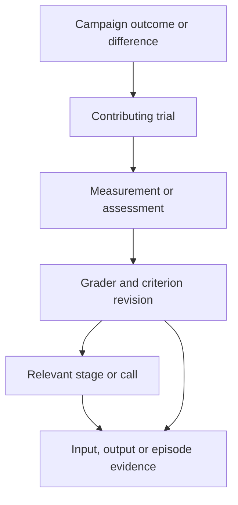

# Inspect a Trial and Explain a Difference

**Status:** Durable trial events, managed stage/episode evidence, bounded range
inspection, producer-clock lanes and paired baseline/candidate traces are implemented
locally. Missing adapter telemetry and cross-clock synchronization remain explicit.
Live-provider and hosted monitoring validation is specification-only.

A score should lead directly to the attempt that produced it. A robotics team needs
to see the inputs, agent outputs, relevant calls, measurements and grading decision
without reconstructing them from logs. Traces and measurements are part of the
evaluation record, alongside outcomes and configuration identity.

| Founding persona | Question the inspector should answer |
| --- | --- |
| Robotics Researcher | Which cases changed between baseline and candidate, and which outputs or measurements explain the difference? |
| ML Engineer on a Manipulation Team | Why was this customer case rejected, incomplete or found to violate a declared constraint? |
| Platform / AI Infrastructure Team | Which configured endpoint, version and call produced this output, and which usage or timing information was actually recorded? |

## Follow an Outcome to Its Evidence

This diagram shows navigation through linked records, not a mandatory sequence of
robot actions. A human assessment may have no numeric measurement; a force limit
may link directly to a sensor interval. Both must identify the evidence supporting
the judgment. A model's explanation remains an output to inspect, not independent
proof of what happened.

ROVE is the evaluation harness; the agent under test may have its own runtime.
Record ROVE's observable stages and calls, and any additional events that runtime
explicitly exposes. Distinguish agent activity from ROVE's evaluation and grading
activity: a verification tool call is not evidence that the candidate agent used
that tool. The inspector does not promise hidden reasoning or internal traces
that an external runtime does not provide.

For ROVE-owned agents, Copilot SDK session events provide message, tool, error and
usage activity for the product timeline. ROVE persists the events needed for trial
history, including essential events the SDK does not replay when a session resumes.
ROVE captures available native SDK spans before removing the temporary workspace
and preserves actual trial/stage/native/tool ancestry. Optional loopback OTLP export
copies structural monitoring fields through a bounded queue; export failure cannot
change trial evidence or metric denominators. It is disabled by default. This local
path is not a deployed Azure/Grafana profile. See
[runtime lifecycle](../architecture/runtime-lifecycle.md),
[local observability](../architecture/runtime-observability.md) and
[ADR-024](../architecture/ADR-024-copilot-runtime-and-observability.md).

The trial page connects three views:

- **Outcome and measurements:** declared criteria, raw and combined verdicts,
  required constraints, measurements, coverage and unresolved evidence. Selecting
  a value reveals its unit, measured population or time window, quality and grader.
- **Timeline:** stages and recorded model/tool/check calls, with their identities,
  ordering, durations and lifecycle states. Show parallel work in separate lanes.
  A failed call, retry or interrupted stage remains visible after the trial ends.
- **Evidence inspector:** selected inputs, preserved outputs, observations and
  measurements alongside frozen identities. Managed byte ranges and indexed JSON
  sample/frame/time ranges load on demand. General video decoding and remote URL
  fetching are unsupported; binary files can be preserved/downloaded within limits.

For example, a placement attempt can fail because its final position is outside
the target. The user opens that outcome, sees the configured target bounds and
measured position, then opens the associated final observation and its producing
trial. If force exceeded a required limit, that constraint's measurement and
interval explain the combined failure separately. An image-to-plan case instead
opens the proposed plan, rubric and SME assessment without requiring force data.

## Preserve What Ran and What Was Observed

One trial identity joins its case version, system snapshot, evaluation contract,
recorded events, outputs and grading revisions. Model/tool calls need stable IDs
and parent stage/call links so a retry can be distinguished from another attempt.
Regrading attaches another assessment to the original evidence; it does not add a
new robot trial or overwrite the earlier grade.

The timeline distinguishes **proposed**, **dispatched**, **acknowledged** and
**observed** activity where an integration supplies those states. A returned
`tool_calls` list is an agent output until execution records establish more. A
predicted trajectory is not an observed robot motion. An acknowledgment alone does
not establish physical completion. When an adapter cannot report internal calls
or retries, display that limit instead of fabricating a complete transcript.

Capture events independently of the browser connection and retain recorded events
through termination and restart. A crash may leave an incomplete trace; label the
gap and interrupted work. Viewing or reopening history must never dispatch the
original actions again. The server's durable record, not a browser cache, is the
source for both the inspector and exported evidence.

Keep raw output text and structured outputs linked to their source call, with an
explicit indication when content was truncated or unavailable. Apply the same
data-sharing boundary as the rest of the report: exclude credential values and
private grading material from candidate inputs. An export may reference assets
that were not included; state that availability rather than implying a complete
recording was transferred.

## Make Timing and Telemetry Interpretable

| Quantity | Meaning |
| --- | --- |
| Summed stage work | Sum of stage durations; concurrent stages can overlap |
| Pipeline wall time | Elapsed time from the defined pipeline start to its end |
| Attempt wall time | The enclosing attempt duration, including its declared startup/cleanup scope |
| Robot task time | Episode time between declared task events, supplied by execution evidence |
| Usage and cost | Recorded provider/call usage and its pricing basis; unavailable when not captured |

Show the timing definition and coverage with each value. Do not label summed stage
work as elapsed time for a parallel pipeline. Usage estimates and measured usage
must be distinguishable. Configured prices without recorded usage are not proof
of spend; missing counters are not zero. The same rule applies to optional device
or resource measurements: display them only when the integration supplies them.

Robot observations and server events may use different clocks. Preserve source
event time, clock identity and sequence separately from ingestion time. Compute
durations within a compatible clock; align sensor or video intervals only with a
declared clock mapping and its uncertainty. If synchronization is unknown, show
separate timelines or uncertain alignment. Arrival order alone must not imply that
a contact observation happened before or after a particular command.

The shared local recorder implements these interpretation boundaries without
requiring an external telemetry service or lakehouse. Host events use their process
clock, native SDK clocks remain separately identified, and each synthetic reset
gets a distinct clock identity. No clock mapping or uncertainty is invented. Trace
projection caps its initial read at 10,000 events and labels incomplete coverage;
paginated raw events remain available.

## Compare the Same Assessment

From a baseline/candidate difference, open the matching case versions and relevant
condition blocks. Show configuration changes, outcomes, measurements and stage or
call evidence side by side. Preserve optional or changed stages instead of forcing
one-to-one call alignment. Explain why a value is absent, unmeasured or graded under
a different criterion.

Paired-trial links show baseline and candidate lanes side by side with each source
clock intact. The comparison helps locate evidence for a difference; it cannot establish
causation from temporal proximity or a score change alone. A stored outcome from
policy A cannot support policy B's physical performance claim. Reviewed plans,
synthetic rollouts and observed physical episodes keep their assessment scope.

## Current Foundation and Acceptance

Quick and campaign trials preserve exposed stage/call events, execution states,
outputs, supplied usage, checks and measurements in the shared SQLite journal.
Stage outputs and explicitly emitted episode evidence are archived as addressed
assets. Evidence identities resolve within their trial; changed or missing bytes
remain unavailable. Arbitrary reference text does not imply a preserved recording.

Assets are bounded to 64 MiB. Sample/frame/time selections require indexed JSON
records; time ranges also need matching source clocks and a declared duration.
Typed robotics recordings validate units, frame and availability. General codecs,
hardware drivers and hidden customer-agent traces are not supplied. Named baseline
revisions pin their assessed outcomes and evidence; later review changes do not
rewrite that saved comparison basis.

See [evidence and exchange](evidence-and-exchange.md),
[robotics evidence](robotics-evidence.md),
[named baselines](named-baselines-and-assistant.md) and
[current implementation](../architecture/current-implementation.md).

Acceptance invariants for the local implementation:

1. **Durable timeline:** a quick trial and a campaign trial preserve recorded
   stage/call events after refresh, interruption and restart. Parallel durations,
   call/retry identities and gaps remain interpretable. Opening history causes no
   execution, and duplicate delivery does not duplicate recorded events.
2. **Evidence navigation:** each displayed outcome or measurement opens the exact
   grader/criterion and available source output or asset range. Quality, units,
   evidence origin, missing references, truncation and clock uncertainty remain
   visible. The browser requests selected recording content on demand; the server
   validates the bounded underlying asset before serving it.
3. **Baseline inspection:** matching cases open side by side with frozen identities,
   complete configuration differences and linked evidence. Missing telemetry stays
   unavailable; stage work, wall time and robot task time remain distinct. Regrades
   and exploratory references cannot increase the count of executed trials.

See [success and reporting](metrics-and-success.md),
[evaluation workflows](evaluation-workflows.md) and
[ADR-022](../architecture/ADR-022-trial-telemetry.md) for related behavior and the
recording decision.
