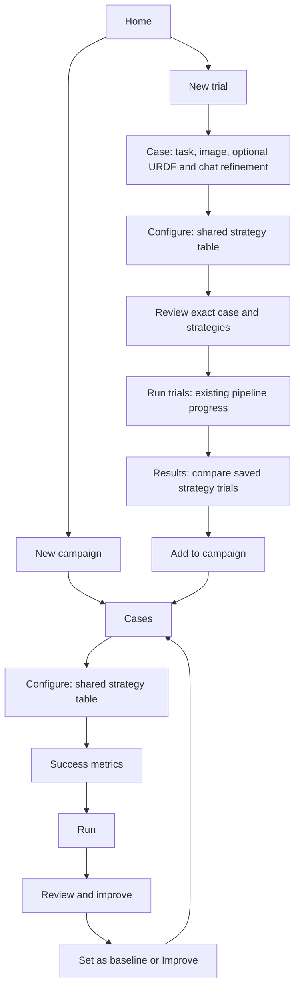
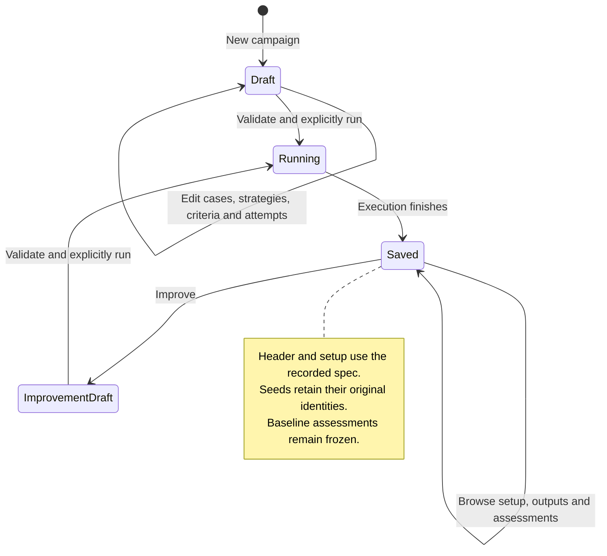

# ROVE evaluation workspace

**Status:** Implemented with automated regression and desktop browser checks recorded
below. Trial/campaign execution, SQLite history, case promotion and baseline services
remain the foundation. Live model/hardware performance is outside this UI validation.
**Decision:** [ADR-031](../architecture/ADR-031-shared-evaluation-workspace.md), which
supersedes conflicting navigation and setup presentation in ADR-030.

**ROVE evaluates robotics agent pipelines on your task.** Compare the same task,
image and robot description across strategies, inspect evidence, and retain campaigns
that make later changes and outcomes traceable.

## Who the journey serves

| Persona | Work to complete | Useful result |
| --- | --- | --- |
| Robotics Researcher | Compare configured strategies and isolate component changes | Repeatable trials, traces and a baseline under recorded conditions |
| ML Engineer on a Manipulation Team | Try customer observations quickly, then broaden coverage | Immediate output comparison and a reviewed evaluation set |
| Platform / AI Infrastructure Team | Maintain strategies/endpoints and automate comparisons | Shared configuration, durable results and equivalent CLI operations |

An SME reviews case validity, reusable annotations or individual outputs. A suggested
criterion is a draft, not an expert judgment. An initial observation supports
perception/planning assessment; physical completion requires outcome evidence from an
execution of the candidate system.

## Navigation and creation

**Trials** and **Campaigns** are peer destinations in the global navigation. They
open saved-record browsers. **Settings** remains a separate gear on the right for
reusable strategies, endpoints and preferences. It is not a workflow stage.

Home offers **New trial** and **New campaign**, using those same creation labels in
the browsers. These actions open drafts; browsing an existing result never creates
or resumes execution. A trial browser row identifies one strategy attempt. Trying
three strategies on one case produces three trials displayed as a useful comparison.

A campaign is a named evaluation of cases, strategies and repetitions. It organizes
fresh trials and their scoring; it does not replace the immediate trial workflow.
Do not introduce competing objects called Quick Evaluation, Experiment or Run.

## Latest entry: try a task, then build a campaign

The quick workspace has **Case → Configure → Review & run → Results**. Case retains the
conversational task refinement, observation upload and optional URDF. Configure uses
the same strategy selection table as campaigns. Review & run shows the observation,
full task, robot file and selected strategies together. Only its Run trials action
executes the existing pipeline;
Results shows saved outputs and evidence, with **Add to campaign**.

**Add to campaign** carries the source task, managed image, robot input when supplied
and exact strategy context. The original trial remains an exploratory reference.
Campaign execution schedules fresh attempts rather than silently increasing its
repetition count with that earlier trial. Configuration drift or missing assets
requires a repair or explicit alternative; a similarly named current strategy is not
a substitute for its historical identity.

Changing quick-workspace stages retains the task, image, robot input and selected
strategies. Progress, original pipeline output, saved trial history and case promotion
remain available. Results opens at the top of the recorded output. Start another
comparison returns to the retained draft without executing. Opening older history
does not pretend to restore its attachments. History and pending sample loads cannot
overwrite a live comparison.

Case must have a task and observation before Configure becomes available. Configure
must have selected strategies before Review & run becomes available. Results remains
unavailable until output exists. Setup locks during execution; task Enter inserts a
line break. Edits invalidate the reviewed input snapshot.

Leaving unfinished work prompts the user to stay or leave. This covers Back to trials,
the top navigation, browser back, reload and close. Switching steps or selecting a
sample retains the draft without a leave prompt. Completed, unchanged inputs with
durable trial results are saved; subsequent edits are an unsaved new draft. See
[ADR-032](../architecture/ADR-032-trial-review-and-navigation-state.md) for the state
model and validation boundary.

## A persistent campaign header

Every campaign stage has one shared header with **Campaign name**, **Attempts per
case** and the live total: **cases × strategies × attempts = planned trials**. The
attempt count applies separately to each selected strategy on each case. For example,
4 cases × 3 strategies × 2 attempts produces 24 trials.

In a new draft, name and attempt count are editable and every selection updates the
total. Invalid counts show an actionable validation message rather than a plausible
number. The server preview remains authoritative for whether execution is permitted.

In a saved campaign, the header and setup are read-only and derive from the recorded
specification. Attempts use the number of recorded seeds, not the maximum seed value,
a default field value or an assumption of consecutive seeds. For seeds `[2, 7, 19]`,
the attempt count is three. Display historical strategy/case identity even when today's
configuration differs. **Improve** creates an editable copy linked to the source;
it never edits the saved execution or baseline in place.

## Campaign stages

### 1. Cases

A task is the robotics objective. A case combines an observation, task, relevant
robot/environment conditions and expected outcome. Several cases can test the same
task under different conditions; no additional Task container is needed.

Provide **Add new**, **Select existing** and **Import cases**. The existing library
uses bounded image cards, search and categories. Datasets are saved case collections
inside that library. Selecting one loads exact case versions for inspection before
choosing strategies. Import supports the existing JSONL/image flow and
[ABC episode import](abc-dataset-support.md); imported demonstrations remain private
reference evidence rather than newly earned candidate success.

Selected cases appear as compact image/task cards with expectations and review
material available on expansion. Preserve other selections when one case is edited
or removed. Source annotations and AI suggestions retain their origin and draft
status. Optional robot geometry belongs only where the assessment needs it.

### 2. Configure

Quick trials and campaigns render one shared strategy table with selection checkboxes
and the configured stage endpoints. The user should see what each selected strategy
will execute without learning two configuration interfaces. Endpoint names describe
existing configuration; selection does not provision or modify a model.

Use the same configured strategies and stage graph as the original runner, including
sequential and parallel execution behavior. The UI presents selection and readiness;
ROVE's engine executes, scores and persists the trials.

**Check configuration** reports **Checking**, **Ready** or **Blocked** inline beside
the relevant controls. Keep the checked selection visible, explain repairable errors,
and invalidate stale feedback when inputs change. Readiness verifies the checks
actually performed; it does not imply live provider availability or model quality.

A controlled component ablation starts from a source strategy, previews changes and
saves an explicit new revision. It does not rewrite the source configuration or a
strategy already recorded by an earlier campaign. Changing cases or scoring broadens
or changes assessment conditions and must remain visible in comparisons.

### 3. Success metrics

This stage separates a rule for judging one trial from statistics computed over
trials. It first presents the campaign's proposed criteria, typically three to five
when appropriate, with individual editing. AI drafts are labelled; without a working
assistant the task-based template is labelled accordingly. Drafting never creates a
judgment or proves the assistant inspected an image.

Each criterion clearly shows:

| Field | Meaning |
| --- | --- |
| Pass condition | What this individual output or episode must demonstrate |
| Checked by | Manual expert review or a named configured verifier |
| Evidence and requirement | Which result is assessed and whether acceptance is required |

A written pass condition is not executable code. **Manual review** remains unscored
until a person records a judgment. **Configured verification** requires a real
configured binding and suitable evidence; changing description text does not program
new verifier behavior. Do not label a criterion automatic merely because it was
suggested by AI.

Below the criteria, show a noninteractive report-statistics table with **How
calculated** and **When available**. These rows explain the report rather than asking
users to invent scoring functions through checkboxes.

| Report statistic | How calculated | When available |
| --- | --- | --- |
| Task success | Accepted outcomes under the campaign's required criteria | After relevant judgments/verifier outcomes exist; unknowns stay visible |
| pass@k | Estimated chance of at least one accepted attempt among k for a case/strategy | Repeated assessed attempts with enough eligible observations |
| pass^k | Estimated chance that all k attempts succeed under the report's estimator | Repeated assessed attempts with enough eligible observations |
| Pipeline latency | Recorded execution duration | When timing is recorded, independently of outcome acceptance |
| Robotics outcome measures | Declared episode measurements such as completion time or intervention | Only when the relevant execution evidence and measurement exist |

The backend remains the authority for exact estimators, denominators, eligibility and
uncertainty. Never substitute a text criterion or an execution-complete badge for
accepted outcome evidence. See [success and performance measures](metrics-and-success.md).

**Reuse criteria from another evaluation** copies its scoring setup into the draft
for review; it does not import outcomes or silently relabel this campaign's trials.
**Technical settings** contains contracts, targets and annotation bindings for users
who need them. Those controls remain functional without dominating the normal path.

### 4. Run

Show the selected cases, strategies, criteria and attempts in a coherent confirmation,
then start only on an explicit execution action. During execution show campaign and
per-strategy progress with inspectable trial and pipeline-stage identities. Execution
completion, failure, cancellation and acceptance remain distinct.

A saved campaign shows its recorded setup rather than editable launch fields. Opening
its Run or Results stage never starts work. Foreground completion opens results
without asking the user to rediscover the report. Changing pages or refreshing
progress must not create duplicate attempts.

### 5. Review and improve

Results are scoped to the selected campaign and begin with outcomes and strategy
charts. An optional AI summary interprets saved evidence and is labelled separately
from measured scores. **Inspect trials** exposes outputs, errors, traces, grader
results and SME review. Scoring/baseline details are progressively disclosed.

For a new draft with no execution, this stage shows **No results yet** and **Go to
Run**. It does not show another campaign picker, unexplained comparison controls or
unrelated saved results. A saved campaign with no recorded attempts states that
condition rather than suggesting that every trial passed.

**Set as baseline** preserves one selected completed strategy's assessment snapshot.
For multiple strategies the user selects the reference explicitly. **Improve** opens
a linked editable draft with its cases, strategies, criteria and repetition plan
prepopulated, alongside recommendations grounded in failed or unassessed trials.
Missing judgments suggest review first; suggested model changes are hypotheses.

Case/strategy/criteria changes are recorded in the connected iteration timeline.
Only matching assessment conditions support a controlled comparison. Broader cases
and changed metrics still provide useful history without justifying an unrestricted
headline improvement. Reassessment does not create another trial; later reviews do
not rewrite a frozen baseline.

**Save case collection** or **Add to an existing collection** creates a dataset
revision with explicit membership and review coverage. Old revisions remain available.
The storage operation called freeze need not appear as a primary user action.

## Visual and interaction requirements

Retain the shared visual token layer and saved theme. Use one consistent global
header, readable stage controls, genuine buttons and generous spacing. Status text
must not obscure the task input. Keep primary actions distinct from record links and
avoid duplicate configuration/name fields on different stages.

Use labelled navigation, real links, visible focus and `aria-current`. Dialogs retain
focus, dismiss accessibly and return focus to their trigger. Announce pending/check
results. Hidden stages leave the tab order. The strategy table must remain usable on
narrow screens without forcing horizontal page scrolling; its endpoint information
must remain accessible. Avoid inventing thumbnails for records without images.

## Routes, saved state and automation

| Route | Purpose |
| --- | --- |
| `/` | Home with New trial and New campaign |
| `/?view=quick` | New or active quick workspace, retaining existing runner compatibility |
| `/static/history.html` | Trials browser and exact trial inspection |
| `/static/benchmarks.html` | Campaigns browser |
| `/static/datasets.html` | New campaign workspace |
| `/static/datasets.html?step=configure` | Campaign strategy selection |
| `/static/datasets.html?step=metrics` | Campaign success criteria and report-statistics explanation |
| `/static/datasets.html?step=run` | Campaign confirmation or saved execution |
| `/static/datasets.html?step=review&campaign=ID` | Review and improve for that saved campaign |
| `/?view=strategies`, `/?view=models`, `/?view=settings` | Settings views |

Back/Forward restores context without replaying actions. Missing IDs show a recovery
route instead of loading a different record. Draft retention within the workspace
must not imply durable cross-reload recovery unless verified. Browser draft state is
separate from frozen server specifications and SQLite evidence.

The [CLI capability guide](cli-ui-parity.md) covers equivalent meaningful operations:
case intake, immediate comparisons, repeated campaigns, reviews, baselines, reports
and timeline. UI refactoring does not replace those services with browser-only logic.
The [CI example](../../examples/ci/README.md) retains explicit study/report artifacts;
it does not assume a persistent runner or establish hosted/live-provider validation.

## Acceptance and delivery evidence

The earlier workspace checks in Git history establish their respective revisions,
not acceptance of this redesign. Verify the following on the new revision:

- Trials/Campaigns browse existing records; New trial/New campaign consistently open
  creation drafts. Settings remains accessible across all workspace pages.
- Quick Case/Configure/Review & run/Results retains chat refinement, task, image, optional robot
  input, chosen strategies, pipeline progress, results, history and Add to campaign.
- Both Configure stages use the same checkbox/stage/endpoint component and selection
  semantics. Inline configuration checks show pending, ready and blocked states.
- Campaign header fields persist across every stage and update from draft selections.
  Saved setup/header uses its exact spec, including nonconsecutive seed identities.
- Success rules distinguish pass condition, reviewer/verifier and required evidence;
  automatic report-statistics explanations cannot be mistaken for executable graders.
- New-draft Results has a focused no-results state. Saved Results retains exact campaign
  scope and its trial inspection, baseline and Improve actions.
- Improve creates an editable source-linked copy; saved cases/strategies/repetition
  plans and frozen baseline assessments remain unchanged.
- Mock multi-strategy execution still creates the expected durable trials and stage
  evidence. Navigation, previews, retries and inspection do not duplicate execution.
- Desktop/narrow and light/dark checks cover focus, overlays, readable controls,
  pending errors, navigation and both complete journeys.

This work changes interaction and presentation. It does not by itself fix or verify
any live VLA adapter, real robot integration, provider availability or physical task
success.

### Verification of the shared workspace, 13 September 2026

Browser checks on the local server covered Trials/Campaigns navigation, a quick mock
execution, automatic Results, Add to campaign with the saved case/strategy, inline
configuration errors, empty draft Results and the frozen campaign strategy table in
light and dark themes. The completed mock trial is
`33199165eac04e30a66ab5c6e949f112`; the trial store increased from 246 to 247 records.
The existing six campaigns were not rerun or modified by this check.

DOM regressions cover a two-strategy SSE comparison with task/image/URDF identity,
late input loads, history isolation, Results scrolling, selection persistence,
configuration approval invalidation and campaign draft/saved-state transitions.
A layout regression loads the legacy campaign and shared styles together to catch
stacked table cells. Narrow-screen browser interaction has not been revalidated in
this pass; responsive rules remain in the shared components. Mock checks establish
workflow behavior, not model or robot task performance.

## Historical verification

These records preserve the evidence referenced by earlier ADRs. They describe earlier
revisions and do not substitute for verification of the shared workspace above.

### Five-stage browser verification, 13 September 2026

The earlier isolated campaign `0dcb416a21a755b2be325b61b061df0c` executed one case
against two mock strategies with three attempts each. All six trials completed, with
zero accepted/rejected and six unassessed outcomes because expert ratings were absent.
Per-strategy stages and a 390px layout were checked. This established that revision's
local execution, unknown-outcome reporting and responsive layout, not live assistant,
policy or hardware performance.

### Trial-to-campaign-to-Improve browser verification, 13 September 2026

The earlier mock trial `edaad514826b4169a6b018fcc242fe69` retained its image/task and
Panda URDF through Add to campaign. Campaign `a868c340bdf15b57ac6d5fa4810d506e`
created three fresh attempts; a saved baseline and Improve led to candidate
`9e772a205b4550a4a2a40400ac758a5b`. Results opened automatically and the comparison
showed matching conditions with no component differences. Outcomes remained pending
review. Cases and criterion editing were checked at 390px. This established lineage
and a no-change comparison in that revision, not measured improvement or hardware use.
