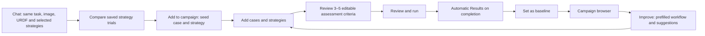
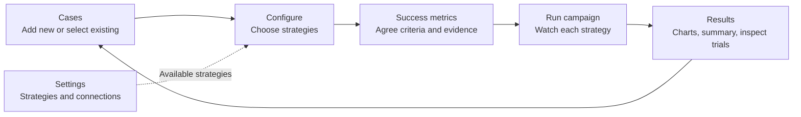
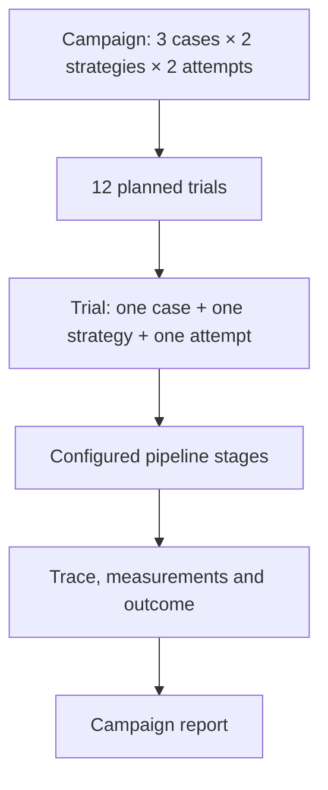
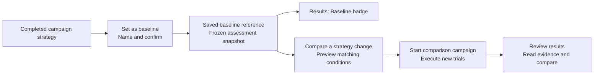

# ROVE campaign workspace

**Status:** Five-stage workspace verified locally. The trial-first entry and guided Improve loop below are implemented with local regression coverage; the complete loop is browser-verified with mock execution and task-based templates. Mock evidence does not establish live AI or hardware performance.
**Decision:** [ADR-025](../architecture/ADR-025-workflow-navigation.md).

**ROVE evaluates robotics agent pipelines on your task.** A customer should bring
the same task, image and robot description, choose a set of configured systems,
compare their outputs immediately, then repeat campaigns to measure improvement. The interface must explain that sequence directly.

## Latest entry: try a task, then build a campaign

The customer's first action is the familiar chat runner: enter the task, provide an
image and optional URDF, and choose the set of strategies to compare. Execution
produces one saved trial per strategy, with outputs and stages available together.
The immediate comparison gives direction; campaigns add repeated evidence over time. **Add to campaign** starts a prepared
campaign workspace from that trial's input and strategy, after which the user can add
cases and strategies. This supersedes treating the chat runner as a secondary legacy
experience. It does not require an additional Quick Evaluation concept in the UI.

**Add to campaign** preserves a link to the source trial. The trial remains an
exploratory reference: a new campaign schedules fresh attempts, and does not count
that earlier execution as an extra repetition. Reuse its managed image, instruction,
robot input where supplied and exact selected strategy. If a source was an ad-hoc
model selection or the reusable configuration changed, resolve an explicit immutable
strategy revision rather than substitute a similarly named current strategy. Missing
source assets/configuration require a visible repair step before launch.

Success metrics presents three to five individually editable assessment criteria when
supported by the task, with an honest task-based template if no AI assistant is
configured. These are rubric rows, not three to five invented performance measures.
Each criterion retains its grading method, evidence needs and required/diagnostic
role. Source expectations remain editable. Suggested criteria do not rate an output
or demonstrate that a robot completed an action.

**Review and run** shows the exact cases, strategies, repetitions and agreed scoring
before execution. Run retains per-strategy progress and trial IDs. The foreground
campaign moves to Results after completion, without asking the user to rediscover the
report. Opening a saved report never resumes or reruns execution.

**Set as baseline** is campaign-level wording for a reference containing one specific
completed campaign strategy and its frozen assessment snapshot. A single-strategy
campaign has an obvious reference; a multi-strategy campaign needs an explicit choice.
The campaign browser's **Improve** action opens the prepopulated workflow, with
recommendations on its first page. Show the source campaign/baseline and findings that
motivate each suggestion. Missing expert judgments suggest reviewing evidence first;
a low observed outcome may support a proposed component ablation as a hypothesis,
not a causal diagnosis.

Keep the baseline's cases, scoring and repetition plan for a controlled component
ablation. Adding cases broadens coverage and changes assessment conditions. The UI
must identify that difference before running and must not advertise an unrestricted
headline improvement against the narrower baseline. The existing comparison validator
remains authoritative; the baseline and its historical evidence are never rewritten.
Improve offers an explicit saved-reference selector (prefilled only when one exists),
and sends the exact baseline revision with the source campaign. Recommendations read
current assessments; comparison values use the frozen reference, even after later reviews.

The source trial already retains the uploaded URDF as a managed robot asset and the
existing promotion service preserves image/task lineage. The handoff now compares the complete public input context before reusing a case,
including the presence or absence of a managed robot description. It preserves robot
assets through promotion and campaign execution and restores missing strategy IDs as
immutable snapshot revisions only when endpoint/default fingerprints still match.
Drift requires explicit candidate selection or component repair. Local regression
coverage exercises these paths; the full-loop browser check below verified saved
robot inputs, criteria editing, automatic Results and an exact baseline comparison.
The earlier six-trial browser check below establishes the preceding campaign workspace.

## Who the journey serves

| Persona | Work to complete | Useful result |
| --- | --- | --- |
| Robotics Researcher | Select representative cases and compare configured strategies under the same criteria | Repeated trials, failure traces and a baseline for a controlled ablation |
| ML Engineer on a Manipulation Team | Add customer images/tasks, describe the expected result and inspect outputs with an SME | A reusable case collection and evidence of which customer tasks succeed, fail or remain unassessed |
| Platform / AI Infrastructure Team | Maintain strategy and endpoint configuration in Settings | Return to an evaluation where those named strategies can be selected and their captured versions inspected |

An SME supplies judgments and annotations. A suggested expected outcome is a draft;
it never becomes an expert judgment merely because the interface populated it.
An initial image can support a perception or planning assessment. It cannot establish
that the robot completed the task without outcome evidence.

## Why the previous design failed

The previous navigation consolidation improved route consistency but left users to
connect cases, contracts, datasets, campaigns and trial history themselves. A long
case dropdown hid the useful image/task gallery. Small links did not explain what
creating a campaign accomplished. Quick evaluation competed with the main workflow,
while configuration and the assistant appeared in unrelated places. A passed route
test did not establish that a customer could understand or complete an evaluation.

## One campaign, five stages

Primary navigation is **Start · Evaluate · Results**. **Settings** sits separately
on the right, providing strategies, models/connections and application preferences.
Configure chooses from those existing strategies. Success metrics is a separate stage
for agreeing what success means and what evidence will establish it. Settings maintains
the reusable configurations themselves; the extra stage creates no new storage entity.

The creation action and destination title both say **Create a campaign**.
“Evaluate” describes the work; **Run campaign** executes the configured campaign.
Neither creates another object called an evaluation or a run. The saved records are
campaigns and trials.
A trial executes one strategy on one case for one repetition. Opening **Review results**
reads saved evidence. **Compare a strategy change** previews differences; only
**Start comparison campaign** executes new trials. ROVE measures improvement rather
than modifying an agent automatically.

Start explains what a campaign produces and offers a clear **Create a campaign**
action. A campaign is a named evaluation of selected cases against selected strategies,
with a chosen number of attempts per case and strategy. It produces a report backed
by individually inspectable trials. A one-case, one-strategy, one-attempt campaign is
the smallest form of the same journey; users need not learn a separate quick workflow.

### 1. Cases: assemble the work to evaluate

A **task** is the robotics objective or instruction. A **case** is one concrete test:
an observation, that task, relevant environment/robot conditions, and an expected
outcome. Several cases can assess the same task under different observations or
conditions. There is no additional persisted Task container. Optional robot geometry
belongs only where the evaluation needs it; the current case intake does not claim a
dedicated URDF upload or validated embodiment contract.

Provide **Add new**, **Select existing** and **Import cases**. Add new opens a dialog
for one image, instruction, name and expected outcome. Select existing opens one
bounded library dialog with **Cases** and **Datasets** tabs. Individual cases use image
previews, search and categories. Datasets are saved case collections, not a competing
execution path. Selecting a dataset loads its exact case versions and scoring rules
into Cases for inspection; the user then chooses **Choose strategies** explicitly.

Selections become image/task cards in the campaign. Expected-outcome and expert-review
details can be expanded per case, keeping the primary list compact. Source annotations
or suggestions remain editable drafts, with their origin made clear. Do not claim
image understanding from a task-derived suggestion alone or create a human review
from populated draft text. Removing or editing a case retains the other selections.

Import cases accepts a JSONL metadata file plus explicitly selected PNG/JPEG images,
matched by filename. Each line describes one case; optional object fields retain
candidate context, conditions, recorded evidence and private reference material. Preview
validates the batch before upload. The current UI accepts 1–100 cases, a JSONL file up
to 1 MiB and images up to 16 MiB each. Images are separate assets, not embedded in
JSONL. Completed imports remain saved if a later import fails; uncertain responses
require checking the library before retrying rather than blindly duplicating cases.

**Save case collection** belongs in Review results after inspecting the selected work.
Offer a new collection or **Add to an existing collection**. Adding creates a new
revision retaining previous members and their exact review choices; it does not rewrite
an earlier dataset. Show resulting membership and review coverage. A collection can
still contain unreviewed cases, but that gap must remain visible. The storage term
"freeze" belongs in technical details rather than the primary action label.

### 2. Configure: choose the strategies

Select one or several strategy cards from the available configuration. A strategy
supplies the pipeline stages, models and endpoints for a trial. The same selected
cases and scoring rules apply to every chosen strategy. For example, **4 cases × 3
strategies × 2 repetitions = 24 trials** in one campaign. Show the selected strategy
names and total before launch; do not make users create separate campaigns to compare
three existing systems on the same data.

Use two clear paths:

| Intent | Setup | Result |
| --- | --- | --- |
| Compare existing strategies | Select several strategies in Configure and run one campaign | Per-strategy results on the same cases, with individual trial evidence |
| Test a component change | Start from a baseline strategy, save a changed strategy revision, then preview a comparison campaign | Candidate results against the preserved baseline under matching assessment conditions |

Strategy editing creates a new reusable revision; it does not rewrite `rove.yaml`
or mutate a strategy used by earlier campaigns. Show its source strategy, changed
components and saved identity. The configuration catalog supplies selectable strategies;
Settings maintains reusable setup, while Configure selects what this campaign runs.
Changing a model or prompt is a candidate change. Changing the cases, grading rules
or required evidence changes the assessment conditions and must be visible before
claiming comparability. A saved revision uses current endpoint settings at campaign creation; the campaign
freezes the complete resolved configuration. The editor starts from the current source
definition, so drift from a saved baseline must be shown. See
[ADR-026](../architecture/ADR-026-versioned-strategy-catalog.md) for the storage and
snapshot boundary.

The optional assistant can help select or revise a strategy after case selection.
Keep the selected cases and strategies as its context, and keep the manual path usable
when the assistant is unavailable. A response or a saved revision never starts trials.

### 3. Success metrics: agree what the result will mean

Give assessment its own stage after strategy selection. A customer should see the
selected cases, the systems being compared and the evidence available before deciding
which results will be useful. Show plain-language **Success criteria**: expected
outcomes, assessment method, required evidence and applicable constraints. Show the
selected report measures and any campaign targets alongside their units and direction.
Advanced contract JSON remains in collapsed details.

The assistant may draft or explain criteria and suitable metrics using those cases
and strategy capabilities. Drafts must be visibly reviewable before they change the
campaign; generated text is neither an SME judgment nor proof of a physical outcome.
An initial-image case can support output or perception assessment. Completion time,
autonomous completion, constraint outcomes and recovery require appropriate episode
evidence. Missing evidence should explain an unavailable measure rather than produce
a score. The user can edit criteria and continue manually without an AI provider.

The existing versioned success contract remains the authoritative record. Both manual
controls and assistant proposals use host validation and exact-preview confirmation.
Changes to cases, strategies or scoring invalidate an obsolete prepared launch; moving
between stages never executes trials. Each selected strategy receives the same case
set and scoring rules so the comparison remains interpretable.

### 4. Run campaign: confirm the configuration and inspect its trials

Show a readable confirmation: campaign name, selected cases, strategy names, success
criteria, repetitions, total planned trials and available execution limits. Explain
unavailable cost estimates rather than rendering them as zero. Keep advanced limits
out of the primary path unless needed. The **Run campaign** action starts the configured trials
only after validation; navigation never starts or resumes work.

Lead with a progress card for each selected strategy: completed/planned attempts,
active or most recent case and explicit queued/running/completed/error state. Never
present the whole campaign as one undifferentiated pipeline. Expanding a strategy
reveals its trials and their pipeline activity.

A pipeline stage is part of a trial, not another trial. Run shows trial identity,
case/task, strategy and attempt number, with links to saved evidence. Campaign progress
refreshes every two seconds while a campaign is active and the Run page is visible.
Active trial stage events also refresh the strategy overview. **Pipeline progress and output** fetches recorded stage events when expanded; **Refresh
this trial** fetches them again. This is recorded-event inspection, not token streaming.
The inline view reads up to 200 events and directs longer traces to the full inspector.
Completion of execution does not imply that the assessment passed.

### 5. Results: understand the outcome, then inspect evidence

Open the exact completed or in-progress campaign. **Review results** reads recorded
outcomes and their supporting traces; it does not execute the pipeline again. Entering
Review refreshes the saved assessments so it reflects trials completed since launch.
Show success, failure, unknown assessments and execution errors distinctly. Attributed
expert review assesses existing outputs and does not add attempts to the denominator.

Present information in this order:

1. Campaign identity, execution completion, assessment coverage and declared target status.
2. Per-strategy outcome charts: passed, failed and unknown counts with a common scale.
   Follow with pass@k and pass^k curves and supported latency/robotics measures.
3. A compact AI outcome summary, when available: what the
   retained evidence supports, the important gaps and a useful next investigation.
4. **Inspect trials** as a disclosure containing the case/strategy/attempt records,
   outputs, measurements, traces and expert review. Baseline and comparison actions
   remain discoverable without exposing the entire evidence ledger immediately.

A graph needs a readable text equivalent and counts; color alone cannot explain an
outcome. Unknown is a distinct segment, never omitted from the denominator. Keep
strategy curves separate. Unresolved lower/upper outcome bounds are not confidence
intervals. A missing value is unavailable, never zero, and no chart should infer a
metric the assessment API withheld. P95 pipeline latency describes pipeline execution,
not robot cycle time. Episode completion time and constraint or recovery results are
shown only with their recorded evidence scope, coverage, units and denominators.

An AI summary explains existing results; it does not change scores or invent causes.
Link claims to retained evidence where available, call out synthetic/recorded/output-only
scope, and separate hypotheses from observations. Provider unavailability leaves the
charts, recorded results and trial inspection fully usable. Opening Results or asking
for an explanation does not launch new trials.

**Set as baseline** is a primary action for a completed campaign. A baseline gives one
campaign strategy the role of a comparison reference, preserving its configuration,
cases, scoring criteria and assessment snapshot. If the campaign contains several
strategies, select the reference strategy explicitly. Name the baseline and save it;
opening its form does not mark the campaign as a baseline or execute trials.

Results shows a **Baseline** badge only when an actual saved baseline references that
campaign. A campaign name containing “baseline,” being the first campaign, or merely
opening the setup form is not sufficient. Pending expert assessments remain unknown
in the saved reference; later ratings do not silently rewrite it. Revision history and
pinning belong in secondary details, after the main reference has been established.

**Compare a strategy change** accepts an existing candidate strategy or helps save a
new revision of the baseline strategy. It shows component differences against the
reference and preserves the baseline's recorded strategy and assessment snapshot. Only **Start comparison campaign**
executes those new trials after preview validation. The reference campaign is not
rerun. ROVE reports improvement or regression; it does not modify the agent itself.

Use explicit collection actions such as **Save reviewed collection** and **Use this
collection in a campaign**. Reusable annotations, case-validity reviews and ratings of
one trial output remain separate. An accepted output is not automatically a reusable
label. Saving a collection or baseline preserves evidence without rerunning it.

## Visual and interaction requirements

Use warm neutral surfaces, slate text and restrained teal accents. Avoid purple
neon accents and gradients. Give the header, step controls and primary buttons enough
height and spacing to communicate hierarchy. Status text must never overlay or shrink
the task composer into unusability. A connection indicator belongs with its relevant
connection or assistant, not on top of the input.

Use one labelled main navigation landmark, real destination links and `aria-current`.
Dialogs need a visible title, keyboard dismissal, focus containment and focus return.
Visible focus, labelled inputs, announced progress and contrast must work in both
themes. Hidden stages must leave the tab order. Narrow layouts must retain readable
labels, usable image cards and the primary action without horizontal page scrolling.

## Routes, state and compatibility

| Route | Ownership |
| --- | --- |
| `/` | Start |
| `/static/datasets.html` | Evaluate, Cases stage |
| `/static/datasets.html?step=configure` | Evaluate, Configure stage |
| `/static/datasets.html?step=metrics` | Evaluate, Success metrics stage |
| `/static/datasets.html?step=run` | Evaluate, Run stage |
| `/static/datasets.html?step=review&campaign=ID` | Review results for that campaign; Results context |
| `/static/benchmarks.html` | Results, campaign reports and comparisons |
| `/static/history.html` and trial parameters | Results, saved trial evidence |
| `/?view=strategies`, `/?view=models`, `/?view=settings` | Settings and its local views |
| `/?view=quick` | Existing single-input chat runner route; trial-first entry |
| `/?view=examples` | Existing sample-library compatibility route; new case-selection actions stay in the campaign workspace |

Local stage changes preserve selected cases, edited criteria and strategy choices.
Back/Forward restores the selected stage without replaying an action. Saved campaign,
case and trial IDs retain their meaning. Missing IDs show a recovery route rather than
silently opening another record. Browser drafts are not durable records unless saved;
full-page reload recovery must not be implied unless implemented and verified.

The single-input chat runner is the preferred trial-first entry in the latest
refinement. It retains saved trials, configured strategies and pipeline output, and
**Add to campaign** connects that result to repeated evaluation. Direct campaign
creation remains available for customers who already have cases to compare.
The advanced manifest builder remains a secondary tool for existing users.

## Acceptance and delivery evidence

The earlier PR #21 had 52 passing UI tests and route/theme browser checks. That is
historical evidence for its implementation, not acceptance of this redesign.

The five-stage refinement has local behavior coverage for metrics navigation, draft
confirmation, per-strategy progress, graph values and explanation fallbacks. Browser
verification below exercised the complete workflow with mock strategies and task-based
templates. Live AI generation remains excluded from this validation.

The following are the continuing acceptance contract:

- Add a customer image/task and select several gallery samples, then edit/remove cases
  without losing other selections or leaving the workspace.
- Keep the picker bounded with many cases; exercise category/search, keyboard dismissal
  and focus return. No ordinary browse action opens the legacy runner.
- Show editable success drafts with accurate source/evidence limitations. No generated
  material writes an SME judgment or reports physical success from an initial image.
- Move through Cases, Configure, Success metrics, Run and Results without losing
  selections or starting work from navigation; back/forward and saved links must agree.
- Show mixed pass/fail/unknown results, unavailable robotics measures, target outcomes
  and unresolved curves accurately; expanded evidence must match chart counts.
- Select configured strategies, inspect success criteria and use the manual path with
  the optional assistant unavailable. Chat changes must follow the same validation.
- Select three existing strategies for the same case set and confirm the full planned
  trial count; each strategy must contribute its own identifiable trials and report row.
- Save a changed strategy revision without altering its source, restart the application,
  then select that exact revision for a baseline comparison. Historical evidence must
  remain readable without resolving the current YAML source again.
- Confirm the case × strategy × repetition count, run an isolated mock campaign, inspect
  identifiable live trials and follow one to its trace and back to the same campaign.
- Add cases to an existing collection and verify the new revision retains prior members
  while old revisions and review identities are unchanged.
- Review a result, save the relevant collection and set a completed campaign strategy
  as baseline without rerunning old trials. Results must show a baseline badge only
  after its reference is saved; opening review or comparison preparation creates no trials.
- Preview a changed strategy against the saved baseline. Only explicit **Start comparison
  campaign** executes new trials; expert reassessment does not increase attempt counts.
- Inspect the complete flow on desktop and narrow screens in both themes, including
  input/status alignment, readable controls, validation errors and browser Back/Forward.

Local DOM regression tests now cover the revised stages, retained drafts, blocked
launches, gallery pagination/search/categories, staged checkbox and image selection,
focus return on close, exact case expectations saved into scoring rules, collection
hydration and membership preservation, stale scoring edits and slow-save responses,
Run identity/deep links, exact strategy/rubric confirmation, and lazy recorded-stage
and output inspection. Review refreshes authoritative assessments when entered after
Run; saved Run links display recorded configuration and hide launch actions. Campaign
refresh preserves expanded trial evidence. Refreshing evidence and browser navigation
do not launch work.
These tests retain the earlier route and preview protections; they do not replace
visual, keyboard and end-to-end browser checks.

Browser verification exercised the full desktop flow in the dark theme using an
isolated three-trial mock campaign: select cases, confirm configuration, execute,
inspect trial evidence and open Review. The stale Review summary found during that
check was corrected and covered by regression tests. The shared shell was also
checked on narrow screens in light and dark themes. These checks establish UI and
local mock behavior, not model quality or robot performance. The 390px case gallery was verified in both themes with bounded scrolling, visible search and category controls, image cards and a fixed selection footer.

Case-specific expected outcomes are saved in the success contract by exact case
revision ID. Editing expectations or scoring controls invalidates the launch preview
and requires confirmation. A late save response cannot activate rules for an older
draft. Collection extension retains prior members and exact review selections while
creating a new revision. Loading a saved collection displays its actual case cards;
adding a case changes the current selection without rewriting that saved collection.
The [workflow specification](evaluation-workflows.md), [success criteria model](metrics-and-success.md)
and [evidence inspector](traces-and-measurements.md) remain authoritative for semantics.

The final integration check created two immutable mock strategy revisions in the UI,
selected both alongside the original, and executed the same case across all three.
All three trials were persisted. Sequential output includes Perceive, Plan, Act and
Verify; parallel agent-loop output follows its actual recorded stages. Internal
perception calls and simulator resets remain telemetry and are not extra pipeline
stages. The original observation/task composer remains available through **Run a
trial**, including an exact saved-case handoff from case details.

SQLite remains the local transactional store. The existing interactive runner
executes selected strategies concurrently; campaign trial slots remain dispatched
serially, while each strategy retains its configured sequential or parallel pipeline
mode. This change does not introduce a new campaign scheduling engine.

### Five-stage browser verification, 13 September 2026

An isolated local instance on port 5014 completed campaign
`0dcb416a21a755b2be325b61b061df0c`: one case, two mock strategy revisions and three
repetitions produced six completed, persisted trials. The flow loaded task-based
success suggestions, required explicit criteria confirmation and launched only from
Run. Each strategy displayed its recorded stage activity: the sequential pipeline
showed four stages and the parallel configuration showed its act/verify path.

Results displayed six unassessed outcomes, zero accepted and zero rejected, matching
the lack of expert ratings despite completed execution. **Inspect trials** began
collapsed. At 390px the measured content width was 384px, with no horizontal page
overflow. This verifies the five-stage local workflow, honest unknown outcomes and
responsive layout; it does not demonstrate live assistant quality, robot motion or
physical success. Earlier gallery verification in both themes remains separate evidence.

Independent review additionally identified saved-contract metadata leaking into edit
requests, stale visible criteria on saved-rule selection, mixed-method criteria losing
their assessment bindings, and misleading template fallback labels. The implementation
was corrected, with focused regression coverage added to the UI checks. Backend tests
use a fake runtime to check generated-draft constraints, cache freshness, evidence
anchors and fallback behavior; no live provider inference was part of this validation.

### Trial-to-campaign-to-Improve browser verification, 13 September 2026

On the isolated local instance at port 5014, an existing case and Panda URDF produced
saved mock chat trial `edaad514826b4169a6b018fcc242fe69`. **Add to campaign** retained
the case, selected strategy and managed robot description. The unconfigured assistant
provided three honestly labelled task-based criteria. Editing and saving the first
criterion, then **Review and run**, created campaign
`a868c340bdf15b57ac6d5fa4810d506e` with three fresh trials and automatically opened Results.

**Set as baseline** saved the reference. **Improve** preserved its three criteria,
repetition defaults and exact baseline revision. A repeat candidate campaign,
`9e772a205b4550a4a2a40400ac758a5b`, also opened Results automatically. Its baseline
comparison reported matching conditions and zero component differences. Outcomes
remained pending expert review; this verified reference preservation and a no-change
comparison, not a measured agent improvement.

At 390px, Cases and Success metrics—including criterion editing—had no horizontal
page overflow. The normal viewport was restored afterward. This check used actual
local mock execution and an unconfigured-AI fallback. It did not call a live provider,
execute a physical robot or establish Panda hardware performance. Sidebar/Settings
presentation corrections are separate from this verified workflow and need their own
final UI checks.

### Scriptable access and improvement over time

The [CLI capability table](cli-ui-parity.md) maps immediate comparisons, data and review
management, campaign execution, baseline improvement and evidence inspection to
supported commands. All use the same validation, configuration loader and durable
assessment services. The [CI example](../../examples/ci/README.md) adds reports,
explicit gates and restoration of a chosen study artifact.

Results includes an evaluation timeline before detailed trial inspection. Its cards
show date, case/repetition counts, strategy outcomes and latency, change badges and
report actions. Technical comparison details stay collapsed. Only validated campaign
source or exact baseline references connect iterations; changing cases, rules or
execution conditions is visible and never presented as continuous performance gain.
Current assessment scores can change after reviews; exact baseline outcomes remain
frozen and distinctly identified.

Browser verification on the isolated mock store displayed the two linked completed
campaigns from the journey above with chronological markers, outcome bars, p95 latency,
same-configuration and synthetic-evidence badges, and usable report/results buttons.
Comparison details started collapsed. At 390px the timeline remained readable with
no horizontal overflow (384px document width). This confirms navigation and evidence
presentation; all outcomes were still awaiting review.
