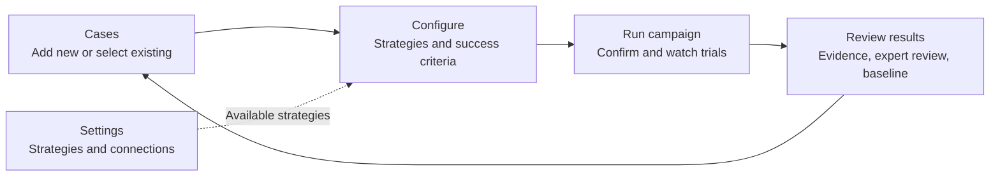
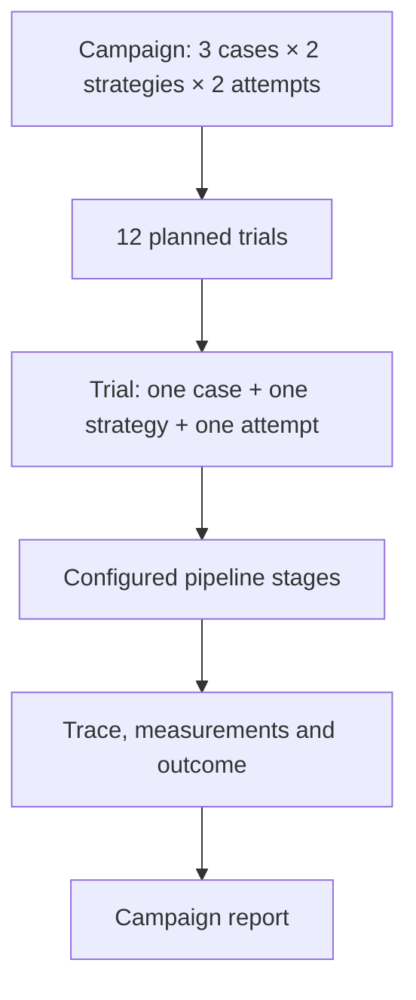
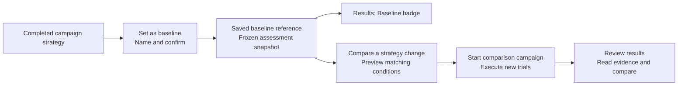

# ROVE campaign workspace

**Status:** Implemented locally with regression coverage and a verified desktop mock campaign; 390px gallery verified in light and dark themes.
**Decision:** [ADR-025](../architecture/ADR-025-workflow-navigation.md).

**ROVE evaluates robotics agent pipelines on your task.** A customer should bring
an image and instruction, choose the configured systems to assess, run the trials,
and understand the evidence. The interface must explain that sequence directly.

## Who the journey serves

| Persona | Work to complete | Useful result |
| --- | --- | --- |
| Robotics Researcher | Select representative cases and compare configured strategies under the same criteria | Repeated trials, failure traces and a baseline for a controlled ablation |
| ML Engineer on a Manipulation Team | Add customer images/tasks, describe the expected result and inspect outputs with an SME | A reusable case collection and evidence of which customer tasks succeed, fail or remain unassessed |
| Platform / AI Infrastructure Team | Maintain strategy and endpoint configuration in Settings | Return to an evaluation where those named strategies can be selected and their captured versions inspected |

An SME supplies judgments and annotations. A suggested expected outcome is a draft;
it never becomes an expert judgment merely because the interface populated it.
An initial image can support a perception or planning assessment. It cannot establish
that the robot completed the task without outcome evidence.

## Why the previous design failed

The previous navigation consolidation improved route consistency but left users to
connect cases, contracts, datasets, campaigns and trial history themselves. A long
case dropdown hid the useful image/task gallery. Small links did not explain what
creating a campaign accomplished. Quick evaluation competed with the main workflow,
while configuration and the assistant appeared in unrelated places. A passed route
test did not establish that a customer could understand or complete an evaluation.

## One campaign, four stages

Primary navigation is **Start · Evaluate · Results**. **Settings** sits separately
on the right, providing strategies, models/connections and application preferences.
Configure is a stage within an evaluation: it chooses from those existing strategies
and defines the assessment. Settings maintains the reusable configurations themselves.

The creation action and destination title both say **Create a campaign**.
“Evaluate” describes the work; **Run campaign** executes the configured campaign.
Neither creates another object called an evaluation or a run. The saved records are
campaigns and trials.
A trial executes one strategy on one case for one repetition. Opening **Review results**
reads saved evidence. **Compare a strategy change** previews differences; only
**Start comparison campaign** executes new trials. ROVE measures improvement rather
than modifying an agent automatically.

Start explains what a campaign produces and offers a clear **Create a campaign**
action. A campaign is a named evaluation of selected cases against selected strategies,
with a chosen number of attempts per case and strategy. It produces a report backed
by individually inspectable trials. A one-case, one-strategy, one-attempt campaign is
the smallest form of the same journey; users need not learn a separate quick workflow.

### 1. Cases: assemble the work to evaluate

A **task** is the robotics objective or instruction. A **case** is one concrete test:
an observation, that task, relevant environment/robot conditions, and an expected
outcome. Several cases can assess the same task under different observations or
conditions. There is no additional persisted Task container. Optional robot geometry
belongs only where the evaluation needs it; the current case intake does not claim a
dedicated URDF upload or validated embodiment contract.

Provide **Add new**, **Select existing** and **Import cases**. Add new opens a dialog
for one image, instruction, name and expected outcome. Select existing opens one
bounded library dialog with **Cases** and **Datasets** tabs. Individual cases use image
previews, search and categories. Datasets are saved case collections, not a competing
execution path. Selecting a dataset loads its exact case versions and scoring rules
into Cases for inspection; the user then chooses **Choose strategies** explicitly.

Selections become image/task cards in the campaign. Expected-outcome and expert-review
details can be expanded per case, keeping the primary list compact. Source annotations
or suggestions remain editable drafts, with their origin made clear. Do not claim
image understanding from a task-derived suggestion alone or create a human review
from populated draft text. Removing or editing a case retains the other selections.

Import cases accepts a JSONL metadata file plus explicitly selected PNG/JPEG images,
matched by filename. Each line describes one case; optional object fields retain
candidate context, conditions, recorded evidence and private reference material. Preview
validates the batch before upload. The current UI accepts 1–100 cases, a JSONL file up
to 1 MiB and images up to 16 MiB each. Images are separate assets, not embedded in
JSONL. Completed imports remain saved if a later import fails; uncertain responses
require checking the library before retrying rather than blindly duplicating cases.

**Save case collection** belongs in Review results after inspecting the selected work.
Offer a new collection or **Add to an existing collection**. Adding creates a new
revision retaining previous members and their exact review choices; it does not rewrite
an earlier dataset. Show resulting membership and review coverage. A collection can
still contain unreviewed cases, but that gap must remain visible. The storage term
"freeze" belongs in technical details rather than the primary action label.

### 2. Configure: choose the systems and define success

Select one or several strategy cards from the available configuration. A strategy
supplies the pipeline stages, models and endpoints for a trial. The same selected
cases and scoring rules apply to every chosen strategy. For example, **4 cases × 3
strategies × 2 repetitions = 24 trials** in one campaign. Show the selected strategy
names and total before launch; do not make users create separate campaigns to compare
three existing systems on the same data.

Use two clear paths:

| Intent | Setup | Result |
| --- | --- | --- |
| Compare existing strategies | Select several strategies in Configure and run one campaign | Per-strategy results on the same cases, with individual trial evidence |
| Test a component change | Start from a baseline strategy, save a changed strategy revision, then preview a comparison campaign | Candidate results against the preserved baseline under matching assessment conditions |

Strategy editing creates a new reusable revision; it does not rewrite `rove.yaml`
or mutate a strategy used by earlier campaigns. Show its source strategy, changed
components and saved identity. The configuration catalog supplies selectable strategies;
Settings maintains reusable setup, while Configure selects what this campaign runs.
Changing a model or prompt is a candidate change. Changing the cases, grading rules
or required evidence changes the assessment conditions and must be visible before
claiming comparability. A saved revision uses current endpoint settings at campaign creation; the campaign
freezes the complete resolved configuration. The editor starts from the current source
definition, so drift from a saved baseline must be shown. See
[ADR-026](../architecture/ADR-026-versioned-strategy-catalog.md) for the storage and
snapshot boundary.

Use plain-language **Success criteria**: what is being assessed, what evidence will
be used, and which constraints or measurements matter. Prefill editable criteria
where trustworthy case metadata exists; label generated material as draft. Explain
missing evidence before launch. A technical success contract remains the versioned
record behind this UI, with advanced JSON available in collapsed details.

The optional evaluation assistant belongs here, after case selection. Its chat can
help prepare or revise the configuration and explain readiness. Both chat and manual
controls use the same host-validated campaign draft; provider availability must not
block the manual workflow. Saving criteria, selecting strategies and assistant replies
do not execute trials. Host confirmation and exact-preview validation remain required.

### 3. Run campaign: confirm the configuration and inspect its trials

Show a readable confirmation: campaign name, selected cases, strategy names, success
criteria, repetitions, total planned trials and available execution limits. Explain
unavailable cost estimates rather than rendering them as zero. Keep advanced limits
out of the primary path unless needed. The **Run campaign** action starts the configured trials
only after validation; navigation never starts or resumes work.

A pipeline stage is part of a trial, not another trial. Run shows trial identity,
case/task, strategy and attempt number, with links to saved evidence. Campaign progress
refreshes every two seconds while a campaign is active and the Run page is visible.
**Pipeline progress and output** fetches recorded stage events when expanded; **Refresh
this trial** fetches them again. This is recorded-event inspection, not token streaming.
The inline view reads up to 200 events and directs longer traces to the full inspector.
Completion of execution does not imply that the assessment passed.

### 4. Review results: inspect evidence, then choose a comparison

Open the exact completed or in-progress campaign. **Review results** reads recorded
outcomes and their supporting traces; it does not execute the pipeline again. Entering
Review refreshes the saved assessments so it reflects trials completed since launch.
Show success, failure, unknown assessments and execution errors distinctly. Attributed
expert review assesses existing outputs and does not add attempts to the denominator.

**Set as baseline** is a primary action for a completed campaign. A baseline gives one
campaign strategy the role of a comparison reference, preserving its configuration,
cases, scoring criteria and assessment snapshot. If the campaign contains several
strategies, select the reference strategy explicitly. Name the baseline and save it;
opening its form does not mark the campaign as a baseline or execute trials.

Results shows a **Baseline** badge only when an actual saved baseline references that
campaign. A campaign name containing “baseline,” being the first campaign, or merely
opening the setup form is not sufficient. Pending expert assessments remain unknown
in the saved reference; later ratings do not silently rewrite it. Revision history and
pinning belong in secondary details, after the main reference has been established.

**Compare a strategy change** accepts an existing candidate strategy or helps save a
new revision of the baseline strategy. It shows component differences against the
reference and preserves the baseline's recorded strategy and assessment snapshot. Only **Start comparison campaign**
executes those new trials after preview validation. The reference campaign is not
rerun. ROVE reports improvement or regression; it does not modify the agent itself.

Use explicit collection actions such as **Save reviewed collection** and **Use this
collection in a campaign**. Reusable annotations, case-validity reviews and ratings of
one trial output remain separate. An accepted output is not automatically a reusable
label. Saving a collection or baseline preserves evidence without rerunning it.

## Visual and interaction requirements

Use warm neutral surfaces, slate text and restrained teal accents. Avoid purple
neon accents and gradients. Give the header, step controls and primary buttons enough
height and spacing to communicate hierarchy. Status text must never overlay or shrink
the task composer into unusability. A connection indicator belongs with its relevant
connection or assistant, not on top of the input.

Use one labelled main navigation landmark, real destination links and `aria-current`.
Dialogs need a visible title, keyboard dismissal, focus containment and focus return.
Visible focus, labelled inputs, announced progress and contrast must work in both
themes. Hidden stages must leave the tab order. Narrow layouts must retain readable
labels, usable image cards and the primary action without horizontal page scrolling.

## Routes, state and compatibility

| Route | Ownership |
| --- | --- |
| `/` | Start |
| `/static/datasets.html` | Evaluate, Cases stage |
| `/static/datasets.html?step=configure` | Evaluate, Configure stage |
| `/static/datasets.html?step=run` | Evaluate, Run stage |
| `/static/datasets.html?step=review&campaign=ID` | Review results for that campaign; Results context |
| `/static/benchmarks.html` | Results, campaign reports and comparisons |
| `/static/history.html` and trial parameters | Results, saved trial evidence |
| `/?view=strategies`, `/?view=models`, `/?view=settings` | Settings and its local views |
| `/?view=quick` | Compatibility entry for the existing single-input runner |
| `/?view=examples` | Existing sample-library compatibility route; new case-selection actions stay in the campaign workspace |

Local stage changes preserve selected cases, edited criteria and strategy choices.
Back/Forward restores the selected stage without replaying an action. Saved campaign,
case and trial IDs retain their meaning. Missing IDs show a recovery route rather than
silently opening another record. Browser drafts are not durable records unless saved;
full-page reload recovery must not be implied unless implemented and verified.

The original single-input pipeline runner remains available for inspecting a standalone
trial, including its configured strategies and existing pipeline output. It retains
saved trials and promotion behavior. This is an optional inspection path; the campaign
workspace remains the primary path for selected cases, repetitions and comparisons.
The advanced manifest builder remains a secondary tool for existing users.

## Acceptance and delivery evidence

The earlier PR #21 had 52 passing UI tests and route/theme browser checks. That is
historical evidence for its implementation, not acceptance of this redesign.

The following are the continuing acceptance contract:

- Add a customer image/task and select several gallery samples, then edit/remove cases
  without losing other selections or leaving the workspace.
- Keep the picker bounded with many cases; exercise category/search, keyboard dismissal
  and focus return. No ordinary browse action opens the legacy runner.
- Show editable success drafts with accurate source/evidence limitations. No generated
  material writes an SME judgment or reports physical success from an initial image.
- Select configured strategies, inspect success criteria and use the manual path with
  the optional assistant unavailable. Chat changes must follow the same validation.
- Select three existing strategies for the same case set and confirm the full planned
  trial count; each strategy must contribute its own identifiable trials and report row.
- Save a changed strategy revision without altering its source, restart the application,
  then select that exact revision for a baseline comparison. Historical evidence must
  remain readable without resolving the current YAML source again.
- Confirm the case × strategy × repetition count, run an isolated mock campaign, inspect
  identifiable live trials and follow one to its trace and back to the same campaign.
- Add cases to an existing collection and verify the new revision retains prior members
  while old revisions and review identities are unchanged.
- Review a result, save the relevant collection and set a completed campaign strategy
  as baseline without rerunning old trials. Results must show a baseline badge only
  after its reference is saved; opening review or comparison preparation creates no trials.
- Preview a changed strategy against the saved baseline. Only explicit **Start comparison
  campaign** executes new trials; expert reassessment does not increase attempt counts.
- Inspect the complete flow on desktop and narrow screens in both themes, including
  input/status alignment, readable controls, validation errors and browser Back/Forward.

Local DOM regression tests now cover the revised stages, retained drafts, blocked
launches, gallery pagination/search/categories, staged checkbox and image selection,
focus return on close, exact case expectations saved into scoring rules, collection
hydration and membership preservation, stale scoring edits and slow-save responses,
Run identity/deep links, exact strategy/rubric confirmation, and lazy recorded-stage
and output inspection. Review refreshes authoritative assessments when entered after
Run; saved Run links display recorded configuration and hide launch actions. Campaign
refresh preserves expanded trial evidence. Refreshing evidence and browser navigation
do not launch work.
These tests retain the earlier route and preview protections; they do not replace
visual, keyboard and end-to-end browser checks.

Browser verification exercised the full desktop flow in the dark theme using an
isolated three-trial mock campaign: select cases, confirm configuration, execute,
inspect trial evidence and open Review. The stale Review summary found during that
check was corrected and covered by regression tests. The shared shell was also
checked on narrow screens in light and dark themes. These checks establish UI and
local mock behavior, not model quality or robot performance. The 390px case gallery was verified in both themes with bounded scrolling, visible search and category controls, image cards and a fixed selection footer.

Case-specific expected outcomes are saved in the success contract by exact case
revision ID. Editing expectations or scoring controls invalidates the launch preview
and requires confirmation. A late save response cannot activate rules for an older
draft. Collection extension retains prior members and exact review selections while
creating a new revision. Loading a saved collection displays its actual case cards;
adding a case changes the current selection without rewriting that saved collection.
The [workflow specification](evaluation-workflows.md), [success criteria model](metrics-and-success.md)
and [evidence inspector](traces-and-measurements.md) remain authoritative for semantics.

The final integration check created two immutable mock strategy revisions in the UI,
selected both alongside the original, and executed the same case across all three.
All three trials were persisted. Sequential output includes Perceive, Plan, Act and
Verify; parallel agent-loop output follows its actual recorded stages. Internal
perception calls and simulator resets remain telemetry and are not extra pipeline
stages. The original observation/task composer remains available through **Run a
trial**, including an exact saved-case handoff from case details.

SQLite remains the local transactional store. The existing interactive runner
executes selected strategies concurrently; campaign trial slots remain dispatched
serially, while each strategy retains its configured sequential or parallel pipeline
mode. This change does not introduce a new campaign scheduling engine.
