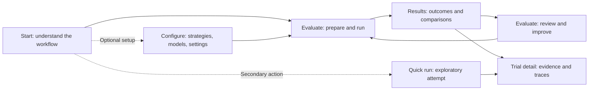
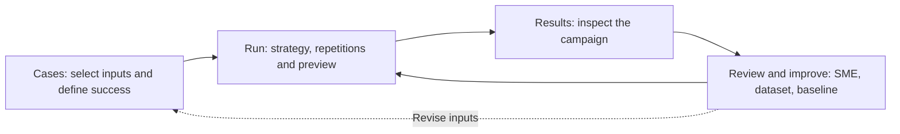

# ROVE user journey and navigation

**Status:** Implemented; locally verified with navigation regression tests and browser checks. PR checks govern merge readiness.
**Decision:** [ADR-025](../architecture/ADR-025-workflow-navigation.md).

**ROVE evaluates robotics agent pipelines on your task.** Navigation should explain
how to do that: choose cases and success criteria, select a strategy and repetitions,
inspect results and traces, then preserve a baseline and improve it. Storage entities
and older tools should support that sequence without competing for the first action.

## Who the journey serves

| Persona | First useful action | Next useful result |
| --- | --- | --- |
| Robotics Researcher | Select cases and a success contract, then compare strategies | Inspect a changed case, preserve a baseline and run a controlled ablation |
| ML Engineer on a Manipulation Team | Bring customer images/tasks and define the required outcome | Review missing or failed evidence with an SME, freeze a dataset and compare a candidate |
| Platform / AI Infrastructure Team | Open Configure and inspect strategies, endpoints and settings | Return to the evaluation, then inspect the configured runtime and supporting traces |

SME review remains an explicit human action within the evaluation journey. Navigation
does not change grading semantics or make a plausible plan into robot completion.

## Four primary destinations

The shared top navigation is **Start · Evaluate · Results · Configure**. Trial
history belongs under Results. Strategies, models and settings are local Configure
tabs. Cases, success contracts, reviews and datasets remain evaluation concepts,
not additional top-level destinations. The current page has one clear active marker.

Start is an overview with four connected steps: **Cases and success → Strategy and
repetitions → Results and traces → Baseline and improvement**. Its main action enters
Evaluate. Quick run is available as a secondary path for an exploratory image/task
attempt; it still records durable history and can later be promoted by reference.

## Evaluate is one workspace

| Workspace step | Primary work | Explicit next action |
| --- | --- | --- |
| Cases | Browse/import cases, retain the selection and choose or create the success contract | Continue to Run |
| Run | Choose the strategy and repetition budget; validate the exact configuration and expected measures | Preview, then launch the campaign |
| Review & improve | Inspect the selected campaign/case, record SME reviews, freeze a dataset, preserve a baseline or prepare an ablation | Save the relevant revision, then return to Run for new trials |

One step is visible at a time. Switching steps retains the in-memory case selection,
contract and campaign context; it does not clear forms or launch a trial. Validation
explains missing requirements where they can be corrected. Returning to Cases to fix
an input does not discard the selected strategy or silently alter a frozen campaign.
The UI must not imply that an unfinished browser draft is already a saved revision.

Results is a reading and investigation hub: open campaign outcomes, comparisons,
reports and their contributing trials. **Review & improve** returns to the evaluation
workspace with the campaign identity in the URL. The existing manifest-based campaign
builder remains a secondary advanced path on Results; it is not the default first-run
experience and still uses the same validation and durable recording services.

## Route ownership and compatibility

These are navigation destinations on the existing pages, not a new backend hierarchy.

| Route | Owning destination and behavior |
| --- | --- |
| `/` | Start overview |
| `/static/datasets.html` | Evaluate workspace; default Cases step |
| `/static/datasets.html?step=run` | Evaluate, Run step; validate retained/selected inputs before launch |
| `/static/datasets.html?step=review&campaign=ID` | Evaluate, Review & improve for an explicit campaign |
| `/static/benchmarks.html` | Results hub, with the advanced manifest builder secondary |
| `/static/history.html` and existing trial-detail parameters | Results → Trials; preserve direct evidence and paired-trace links |
| `/?view=strategies` | Configure → Strategies |
| `/?view=models` | Configure → Models |
| `/?view=settings` | Configure → Settings |
| `/?view=quick` | Secondary Quick run |
| `/?view=examples` | Compatibility entry to the sample library; existing links remain usable |

Existing static URLs, campaign/trial identifiers and API routes retain their meaning.
A navigation click must never replay an action. Unsupported view/step values fall
back to a visible usable destination. Missing or stale campaign IDs show an explicit
state and a route back to Results; they must not silently select another campaign.
Back/forward navigation and direct entry restore the route's selected view. Preserving
in-memory form state is separate from durable case, dataset and campaign records.

## Accessibility and acceptance

The acceptance checks below are required; browser results must be recorded separately.

- Use one labelled main-navigation landmark, real links for destinations and a clear
  `aria-current` marker. Local view controls have visible selected states and keyboard
  activation. Hidden panels are absent from keyboard and assistive-technology flow.
- Keep a logical heading hierarchy, visible focus, labelled controls and announced
  validation/progress messages. Responsive layouts and both themes retain contrast,
  readable labels and reachable primary actions without horizontal page scrolling.
- Start shows the product purpose and next action before advanced configuration.
  Every step explains its current selection and what the user should do next.
- A researcher can select cases, launch and inspect a campaign, pin a baseline and
  prepare an ablation without guessing which top-level destination owns the task.
- An ML engineer can import a case, define success, return from Results to the exact
  campaign's review step and preserve selections while correcting an input.
- A platform engineer can open each Configure tab directly and return to Evaluate.
  Quick run, sample-library links, advanced manifests and old evidence links still work.
- Tests cover initial routes, invalid parameters, active navigation, step visibility,
  retained context, review deep links and no execution caused by navigation. Browser
  checks cover those journeys plus keyboard focus, narrow screens and light/dark themes.

The [workflow specification](evaluation-workflows.md), [success contract](metrics-and-success.md)
and [evidence inspector](traces-and-measurements.md) continue to define evaluation
semantics. This change simplifies how users reach those capabilities.

## Delivery evidence

The shared header and step routing have 52 passing UI tests, including retained
quick-trial drafts, workflow Back/Forward, blocked launches, campaign deep links,
missing-result recovery and explicit advanced actions. Browser inspection verified
the landing page, case/run steps, campaign review and the Results/Trials hierarchy
in dark and light themes, including 390 px navigation. API-level campaign and
trial links use an isolated synthetic evaluation. Unsaved drafts remain in memory;
full-page reloads restore saved identities, not unsaved form data.
