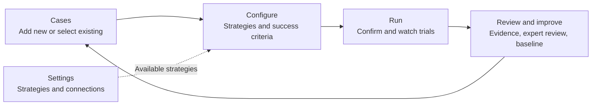
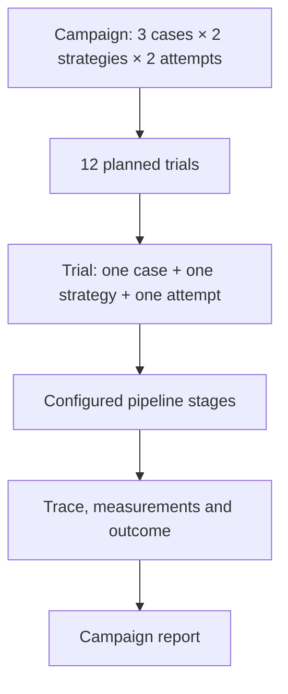

# ROVE campaign workspace

**Status:** Implemented locally with regression coverage and a verified desktop mock campaign; 390px gallery verified in light and dark themes.
**Decision:** [ADR-025](../architecture/ADR-025-workflow-navigation.md).

**ROVE evaluates robotics agent pipelines on your task.** A customer should bring
an image and instruction, choose the configured systems to assess, run the trials,
and understand the evidence. The interface must explain that sequence directly.

## Who the journey serves

| Persona | Work to complete | Useful result |
| --- | --- | --- |
| Robotics Researcher | Select representative cases and compare configured strategies under the same criteria | Repeated trials, failure traces and a baseline for a controlled ablation |
| ML Engineer on a Manipulation Team | Add customer images/tasks, describe the expected result and inspect outputs with an SME | A reusable case collection and evidence of which customer tasks succeed, fail or remain unassessed |
| Platform / AI Infrastructure Team | Maintain strategy and endpoint configuration in Settings | Return to an evaluation where those named strategies can be selected and their captured versions inspected |

An SME supplies judgments and annotations. A suggested expected outcome is a draft;
it never becomes an expert judgment merely because the interface populated it.
An initial image can support a perception or planning assessment. It cannot establish
that the robot completed the task without outcome evidence.

## Why the previous design failed

The previous navigation consolidation improved route consistency but left users to
connect cases, contracts, datasets, campaigns and trial history themselves. A long
case dropdown hid the useful image/task gallery. Small links did not explain what
creating a campaign accomplished. Quick evaluation competed with the main workflow,
while configuration and the assistant appeared in unrelated places. A passed route
test did not establish that a customer could understand or complete an evaluation.

## One campaign, four stages

Primary navigation is **Start · Evaluate · Results**. **Settings** sits separately
on the right, providing strategies, models/connections and application preferences.
Configure is a stage within an evaluation: it chooses from those existing strategies
and defines the assessment. Settings maintains the reusable configurations themselves.

The creation action and destination title both say **Create a campaign**.
“Evaluate” is an activity label; a campaign is the saved record containing trials.

Start explains what a campaign produces and offers a clear **Create a campaign**
action. A campaign is a named evaluation of selected cases against selected strategies,
with a chosen number of attempts per case and strategy. It produces a report backed
by individually inspectable trials. A one-case, one-strategy, one-attempt campaign is
the smallest form of the same journey; users need not learn a separate quick workflow.

### 1. Cases: assemble the work to evaluate

Provide two obvious actions: **Add new** and **Select existing**. Select existing
opens a bounded, scrollable gallery dialog with image previews, task instructions,
search and categories. Reuse the sample-library interaction rather than an endlessly
growing select control. Confirming a selection adds cards to the campaign; it does
not navigate away or execute anything.

Add new captures an image, instruction and case name. Show the observation and task
together, plus an editable expected outcome and expert-review draft. Suggestions
must identify their source: supplied sample annotations, task-derived draft, or an
explicitly configured image-capable assistant. Do not claim image understanding from
text extraction alone. Each added case appears below as a card, with clear remove
and edit actions. The user can add multiple cases through either path.

**Save case collection** preserves selected cases as a versioned dataset. Offer
**Create a collection** and **Add to an existing collection**. Adding creates a new
revision containing the prior members plus the new case revisions; it never rewrites
an earlier dataset or silently drops its existing cases. Show the resulting member
count and revision. Reviews remain explicitly incomplete until a person supplies them.
The storage term "freeze" belongs in technical details, not the primary action label.

### 2. Configure: choose the systems and define success

Show the named strategies already available from `rove.yaml`, with enough stage and
model information to make the selection meaningful. Do not make the user recreate
existing strategies in a second form. A link to Settings supports changes to the
underlying configuration, with a clear route back to the campaign.

Use plain-language **Success criteria**: what is being assessed, what evidence will
be used, and which constraints or measurements matter. Prefill editable criteria
where trustworthy case metadata exists; label generated material as draft. Explain
missing evidence before launch. A technical success contract remains the versioned
record behind this UI, with advanced JSON available in collapsed details.

The optional evaluation assistant belongs here, after case selection. Its chat can
help prepare or revise the configuration and explain readiness. Both chat and manual
controls use the same host-validated campaign draft; provider availability must not
block the manual workflow. Saving criteria, selecting strategies and assistant replies
do not execute trials. Host confirmation and exact-preview validation remain required.

### 3. Run: confirm the evaluation and inspect its attempts

Show a readable confirmation: campaign name, selected cases, strategy names, success
criteria, repetitions, total planned trials and available execution limits. Explain
unavailable cost estimates rather than rendering them as zero. Keep advanced limits
out of the primary path unless needed. A visible run action starts the evaluation
only after validation; navigation never starts or resumes work.

A pipeline stage is part of a trial, not another trial. Run shows trial identity,
case/task, strategy and attempt number, with links to saved evidence. Campaign progress
refreshes every two seconds while a campaign is active and the Run page is visible.
**Pipeline progress and output** fetches recorded stage events when expanded; **Refresh
this trial** fetches them again. This is recorded-event inspection, not token streaming.
The inline view reads up to 200 events and directs longer traces to the full inspector.
Completion of execution does not imply that the assessment passed.

### 4. Review and improve: explain the result and the next change

Open the exact completed or in-progress campaign. Connect summary measures to case
outcomes and contributing trials. Show success, failure, unknown assessments and
execution errors distinctly. Let the user inspect traces, measurements and evidence,
record attributed expert judgments, save the reviewed case collection, and establish
a named baseline before comparing a changed strategy.

Use explicit action labels such as **Save reviewed collection**, **Use this collection
in a campaign** and **Set as baseline**. Explain what each action preserves or changes.
Reusable annotations, case-validity reviews and ratings of one trial output remain
different records; an accepted output is not automatically a label for future trials.
Reassessing an existing output must not increase the trial count.

## Visual and interaction requirements

Use warm neutral surfaces, slate text and restrained teal accents. Avoid purple
neon accents and gradients. Give the header, step controls and primary buttons enough
height and spacing to communicate hierarchy. Status text must never overlay or shrink
the task composer into unusability. A connection indicator belongs with its relevant
connection or assistant, not on top of the input.

Use one labelled main navigation landmark, real destination links and `aria-current`.
Dialogs need a visible title, keyboard dismissal, focus containment and focus return.
Visible focus, labelled inputs, announced progress and contrast must work in both
themes. Hidden stages must leave the tab order. Narrow layouts must retain readable
labels, usable image cards and the primary action without horizontal page scrolling.

## Routes, state and compatibility

| Route | Ownership |
| --- | --- |
| `/` | Start |
| `/static/datasets.html` | Evaluate, Cases stage |
| `/static/datasets.html?step=configure` | Evaluate, Configure stage |
| `/static/datasets.html?step=run` | Evaluate, Run stage |
| `/static/datasets.html?step=review&campaign=ID` | Review and improve for that campaign; Results context |
| `/static/benchmarks.html` | Results, campaign reports and comparisons |
| `/static/history.html` and trial parameters | Results, saved trial evidence |
| `/?view=strategies`, `/?view=models`, `/?view=settings` | Settings and its local views |
| `/?view=quick` | Compatibility entry for the existing single-input runner |
| `/?view=examples` | Existing sample-library compatibility route; new case-selection actions stay in the campaign workspace |

Local stage changes preserve selected cases, edited criteria and strategy choices.
Back/Forward restores the selected stage without replaying an action. Saved campaign,
case and trial IDs retain their meaning. Missing IDs show a recovery route rather than
silently opening another record. Browser drafts are not durable records unless saved;
full-page reload recovery must not be implied unless implemented and verified.

Legacy single-input runs retain their saved trials and promotion behavior. Keeping
these APIs and old links compatible does not require advertising a competing quick
workflow. The advanced manifest builder remains a secondary tool for existing users.

## Acceptance and delivery evidence

The earlier PR #21 had 52 passing UI tests and route/theme browser checks. That is
historical evidence for its implementation, not acceptance of this redesign.

The following are the continuing acceptance contract:

- Add a customer image/task and select several gallery samples, then edit/remove cases
  without losing other selections or leaving the workspace.
- Keep the picker bounded with many cases; exercise category/search, keyboard dismissal
  and focus return. No ordinary browse action opens the legacy runner.
- Show editable success drafts with accurate source/evidence limitations. No generated
  material writes an SME judgment or reports physical success from an initial image.
- Select configured strategies, inspect success criteria and use the manual path with
  the optional assistant unavailable. Chat changes must follow the same validation.
- Confirm the case × strategy × repetition count, run an isolated mock campaign, inspect
  identifiable live trials and follow one to its trace and back to the same campaign.
- Add cases to an existing collection and verify the new revision retains prior members
  while old revisions and review identities are unchanged.
- Review a result, save the relevant collection and establish a baseline without rerunning
  old trials or counting a review as another attempt.
- Inspect the complete flow on desktop and narrow screens in both themes, including
  input/status alignment, readable controls, validation errors and browser Back/Forward.

Local DOM regression tests now cover the revised stages, retained drafts, blocked
launches, gallery pagination/search/categories, staged checkbox and image selection,
focus return on close, exact case expectations saved into scoring rules, collection
hydration and membership preservation, stale scoring edits and slow-save responses,
Run identity/deep links, exact strategy/rubric confirmation, and lazy recorded-stage
and output inspection. Review refreshes authoritative assessments when entered after
Run; saved Run links display recorded configuration and hide launch actions. Campaign
refresh preserves expanded trial evidence. Refreshing evidence and browser navigation
do not launch work.
These tests retain the earlier route and preview protections; they do not replace
visual, keyboard and end-to-end browser checks.

Browser verification exercised the full desktop flow in the dark theme using an
isolated three-trial mock campaign: select cases, confirm configuration, execute,
inspect trial evidence and open Review. The stale Review summary found during that
check was corrected and covered by regression tests. The shared shell was also
checked on narrow screens in light and dark themes. These checks establish UI and
local mock behavior, not model quality or robot performance. The 390px case gallery was verified in both themes with bounded scrolling, visible search and category controls, image cards and a fixed selection footer.

Case-specific expected outcomes are saved in the success contract by exact case
revision ID. Editing expectations or scoring controls invalidates the launch preview
and requires confirmation. A late save response cannot activate rules for an older
draft. Collection extension retains prior members and exact review selections while
creating a new revision. Loading a saved collection displays its actual case cards;
adding a case changes the current selection without rewriting that saved collection.
The [workflow specification](evaluation-workflows.md), [success criteria model](metrics-and-success.md)
and [evidence inspector](traces-and-measurements.md) remain authoritative for semantics.
