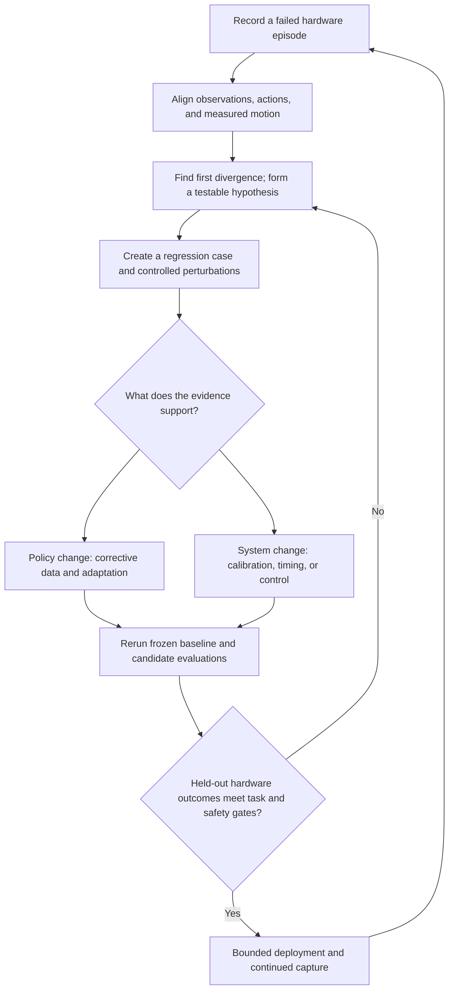

# When simulation passes but the robot deviates
## A proposed sim-to-real evaluation loop for ROVE

**Author:** Nik Sachdeva  
**Status:** Design proposal, September 24, 2026. No physical-robot results are claimed.

[ROVE](../README.md) is an experimental robotics evaluation workbench. It compares configured strategies, preserves trial evidence, and tracks changes against explicit baselines. This note proposes an extension to that workflow to investigate a VLA that succeeds in simulation but deviates on hardware.

The first question is whether the evaluation represents the deployed system. A model producing plausible actions, or passing geometric checks, is different from a robot completing a task through repeated observation and execution.

### Reference: NVIDIA's SO-101 sim-to-real course

The main reference is NVIDIA's [Train an SO-101 Robot From Sim-to-Real With NVIDIA Isaac](https://docs.nvidia.com/learning/physical-ai/sim-to-real-so-101/latest/09-strategy1-dr-teleop.html). It provides a concrete VLA manipulation example. The workflow below applies that guidance to a proposed ROVE extension. The course's hardware path is not integrated into ROVE.

| Course guidance | Proposed application in ROVE |
| --- | --- |
| [Domain randomization](https://docs.nvidia.com/learning/physical-ai/sim-to-real-so-101/latest/09-strategy1-dr-teleop.html): vary lighting, camera pose, and object placement while collecting demonstrations; use the policy's camera views during teleoperation. | Record the variation settings with each case and check that demonstration observations match the policy's inputs. |
| [Sim evaluation](https://docs.nvidia.com/learning/physical-ai/sim-to-real-so-101/latest/11-sim-evaluation.html): compare nominal evaluation with stronger lighting variation. | Keep separate baseline and stress-test results to reveal which conditions cause failures. |
| [Real evaluation](https://docs.nvidia.com/learning/physical-ai/sim-to-real-so-101/latest/12-real-evaluation.html): evaluate the same checkpoint through a shared GR00T server setup, replacing the simulator client with the robot client. | Preserve checkpoint identity across environments while recording each client's configuration and measured outcome. |
| [SAGE + GapONet](https://docs.nvidia.com/learning/physical-ai/sim-to-real-so-101/latest/15-strategy4-sage.html): compare paired real/sim motions and quantify actuation differences per joint. | Use measured actuation gaps to select targeted simulator or controller changes before considering policy adaptation. |

### The workflow

Policy and system causes can coexist. Change one suspected factor at a time before testing their interaction; a trace correlation alone does not establish root cause.

### 1. Establish an execution contract

Before changing the model, verify camera views, image preprocessing, measured-state ordering, coordinate frames, action units, normalization, gripper conventions, and controller interpretation. Freeze the checkpoint, processors, controller settings, and robot configuration with the trial.

For chunked actions, record the prediction horizon, executed prefix, control frequency, and when fresh observations arrive. A policy evaluated with immediate simulated feedback may face stale observations or queued actions on hardware.

### 2. Capture enough evidence to distinguish failures

Record the instruction, timestamped images and measured state, native model output, transformed controller commands, execution acknowledgements, and actual motion. Preserve clock domains and synchronization uncertainty. Include contact or force measurements where available and an independently assessed terminal outcome.

Compare intended commands with measured response around the first deviation. Tracking error suggests an execution issue, but incorrect input or action mappings must also be ruled out. Accurate tracking of an unsuccessful command points toward policy or observation problems; it does not prove them.

Offline replay helps inspect decisions on recorded observations. It cannot establish how a changed policy would complete the task: after its first different action, the future scene may differ. That requires a fresh closed-loop rollout.

### 3. Make the eval reproduce deployment conditions

| Suspected gap | Controlled eval change | Evidence to inspect |
| --- | --- | --- |
| Perception or calibration | Camera offsets, lighting, occlusion, motion blur | Failure onset and success by condition |
| Contact dynamics | Measured ranges of friction, mass, compliance, and slip | Grasp retention and task outcome |
| Timing and action chunks | Observation delay, jitter, dropped frames, executed-prefix length | Observation age at execution, tracking error, recovery |
| Distribution shift | Held-out objects, layouts, and starting states | Success by task and condition |
| Error accumulation | Mid-task object displacement or grasp disturbance | Recovery without intervention; safe stop when needed |

Start with ranges measured on the robot. Test single factors to investigate causes, then combinations to test robustness. Update the simulator where its behavior fails to reproduce the relevant hardware response. Retain a separate hardware evaluation set; calibrating the simulator to known failures is not evidence of generalization.

### Worked example: a grasp changes under different lighting

**Illustrative experiment, not a measured ROVE result.** Suppose the robot completes a pick-and-place task in nominal simulation but misses the grasp under a different workcell light.

1. Verify camera mapping and preprocessing, then check whether actual motion follows the commanded motion.
2. Keep the checkpoint fixed and compare nominal lighting with a controlled lighting sweep. Keep camera pose and object placement fixed initially.
3. If the failure follows lighting, collect varied demonstrations and adapt a candidate checkpoint. Keep a calibration fix as a separate candidate if calibration is also suspect.
4. Compare both checkpoints on the frozen evaluation cases, including separate held-out hardware trials. Report grasp and full-task outcomes separately.

This uses the course's nominal-versus-varied-lighting evaluation as a starting point. The controlled comparisons and held-out decision procedure are proposed ROVE evaluation design. Randomization used for training improves coverage; randomization used for evaluation tests robustness. The two datasets must remain separate.

### 4. Improve the part responsible

For a policy failure, collect demonstrations or corrective interventions around the failure states, adapt the policy outside the evaluation runner, and register the resulting checkpoint as a new strategy. For an interface or control failure, correct that component and preserve its revision instead. Training should not compensate for an unverified action mapping.

Compare baseline and candidate from matched starting conditions with fresh observations throughout each episode. Keep task budgets and success criteria fixed. Use separate diagnostic, training, and held-out evaluation episodes; split related recordings together to avoid leakage.

### 5. Decide using outcomes

The primary measure is **task success without human intervention**, subject to explicit safety constraints. Report recovery success on eligible disturbance trials, interventions, completion time, and observation-to-execution latency. Break down results by failure condition and include trial counts and uncertainty.

The unit of evaluation is a complete episode, not each action chunk. Keep missing evidence and aborted trials visible rather than silently excluding them. Safety limits and acceptable task performance come from the workcell requirements; independent robot safety controls remain outside the learned policy.

### What ROVE supplies today, and what this adds

ROVE already provides versioned cases and strategies, repeated campaigns, explicit baselines, traces, and evidence-backed assessments. Its image-based VLA path supports action-level inspection. A separate experimental ABC integration implements simulator episode execution and reporting.

The repository documents CPU simulator and data-path checks; GPU learned-policy performance and physical-robot execution remain unvalidated. This proposal adds a hardware episode contract, failure-derived perturbation campaigns, and hardware validation gates. It does not claim those capabilities are already delivered.

Implementation context:
- [Action-level versus episode-level evaluation](product/action-and-episode-evaluation.md)
- [Experimental ABC-VLA and pi0.5 comparison and validation scope](product/abc-pi05-comparison.md)

**The engineering goal:** make evaluation failures informative enough to choose the next change, and make a passing evaluation a better predictor of real task completion.
