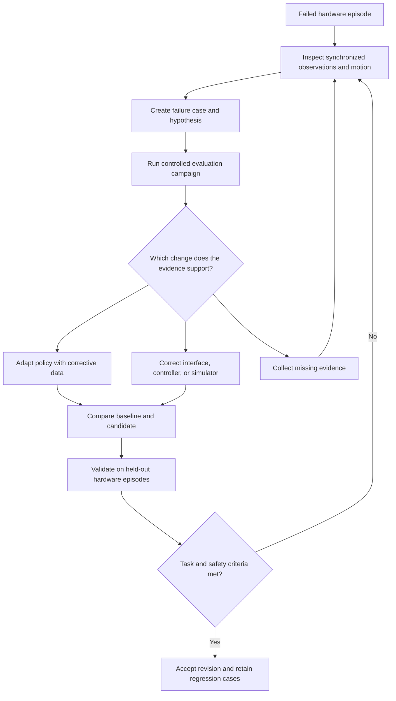
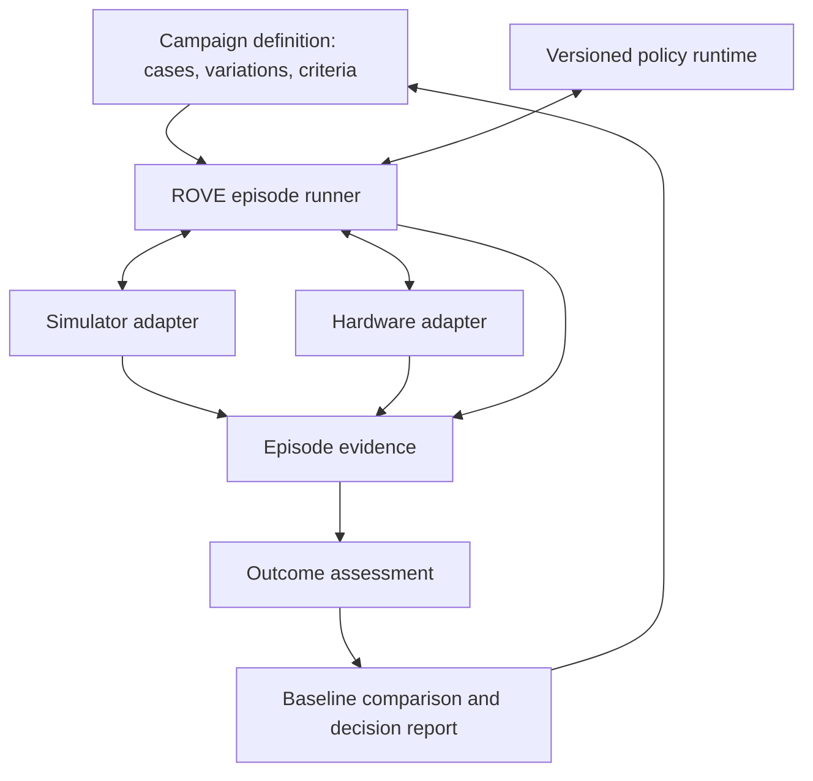

# ROVE: Closing the sim-to-real evaluation loop

**Design specification · Nik Sachdeva · September 2026**

A VLA completes a task in simulation but misses the grasp, drifts from the intended motion, or fails to recover on hardware. The engineer needs to know where the behavior diverges, which conditions expose the failure, and whether a proposed change improves the physical outcome.

[ROVE](../README.md) would connect that investigation to a repeatable evaluation campaign. Each deployment failure becomes a test case; each policy or system change is compared against a preserved baseline. The resulting report supports a concrete decision: accept the change, investigate further, or collect the evidence still missing.

## From a failed episode to a decision

An engineer opens a failed episode and inspects camera observations alongside model actions, controller commands, and measured motion. The engineer marks the first meaningful deviation and creates a case around a suspected cause. ROVE retains that hypothesis separately from the measurements supporting it.

The engineer then configures a controlled campaign: vary the suspected factor, preserve the other conditions, and compare complete task outcomes. A lighting problem calls for different tests from a delayed action queue or a slipping gripper. Once an intervention is selected, the original and changed strategies run against the same evaluation definition, followed by held-out hardware validation.

## System design

ROVE owns evaluation definitions, experiment scheduling, evidence, and comparisons. Environment adapters own reset, observation capture, action execution, and stop behavior. Policy runtimes and training tools remain separate integrations.

| Component | Responsibility |
| --- | --- |
| Episode runner | Schedule repeated attempts, enforce budgets, and preserve partial evidence on interruption. |
| Environment adapter | Confirm initial state, supply fresh observations, execute valid commands, and acknowledge completion or stop. |
| Policy interface | Preserve checkpoint, processors, observation mapping, action conventions, and chunk execution settings. |
| Evidence store | Link timestamped observations, native actions, transformed commands, measured motion, and outcomes to exact configuration revisions. |
| Assessment | Apply versioned task and constraint checks through a configured evaluator or human review; retain unknown outcomes explicitly. |
| Comparison report | Show baseline and candidate performance by condition, with trial counts, uncertainty, and links to the underlying episodes. |

A robot description alone does not establish policy compatibility. Before execution, the adapter must validate joint ordering, coordinate frames, units, normalization, camera mapping, and controller interpretation. Unverified mappings block execution. Clock domains and synchronization uncertainty travel with the evidence so apparent timing differences are not mistaken for physical errors.

## What changes in the evaluation

The evaluation expands from nominal simulated success to a set of conditions derived from deployment failures.

| Failure hypothesis | Evaluation change | Decision supported |
| --- | --- | --- |
| Visual conditions alter the selected action | Sweep lighting or camera pose while holding scene and checkpoint fixed. | Correct calibration or collect targeted visual demonstrations. |
| Commands are valid but actual motion differs | Compare matched motions in simulation and hardware; inspect per-joint tracking, friction, and contact behavior. | Improve actuator or physics modeling, or correct the controller. |
| Actions arrive too late | Inject measured observation delays and jitter; vary the executed action prefix. | Change inference placement, scheduling, or chunk execution. |
| Small errors accumulate during the task | Introduce a bounded grasp slip or object displacement mid-episode. | Improve recovery behavior or shorten the interval before fresh observations. |
| Performance depends on familiar scenes | Evaluate held-out objects, layouts, and starting states. | Broaden training coverage and test generalization. |

Randomization ranges should reflect measured deployment variation. Single-factor tests support diagnosis; combined variations test robustness. Expanding every range indiscriminately can obscure the cause and increase training cost.

Recorded observations can be replayed to inspect a policy's decisions. They cannot establish the outcome of a different action sequence. Candidate success requires a fresh closed-loop episode in which the next observation reflects what the candidate actually did.

## Example: a missed grasp under workcell lighting

Consider a policy that grasps correctly in nominal simulation but misses the object under a different workcell light. This is an illustrative investigation, not a reported ROVE result.

First, verify camera assignment and preprocessing, then check whether the physical arm follows its commands. If execution tracks correctly, run the unchanged checkpoint across a lighting sweep with fixed camera pose and object placement. Inspect where grasp success declines and whether the same failure appears on hardware.

If the evidence supports visual sensitivity, collect demonstrations around those conditions and adapt a candidate checkpoint outside the evaluation runner. Preserve the original checkpoint as the baseline. A calibration correction, if needed, is a separate revision so its effect can be measured.

Compare the candidates on the frozen case set and separate held-out hardware trials. Report grasp acquisition and final object placement separately: improving the grasp is insufficient if the robot still drops the object before completing the task.

## The decision report

The report opens with whether the candidate meets the declared task requirements and what remains unresolved. It includes:

- **Task success without intervention:** completed episodes against planned attempts, with failures, interruptions, and unknown outcomes visible.
- **Performance by condition:** results for each tested variation, so an aggregate gain cannot hide a deployment weakness.
- **Recovery and operating cost:** recovery on eligible disturbance trials, intervention frequency, completion time, and observation-to-execution latency.
- **Constraint violations:** recorded safety-related violations and missing checks, assessed against workcell-specific limits.
- **Change history:** what changed, which evidence supports improvement, and whether the comparison conditions remained equivalent.

The sampling unit is a complete episode. Action chunks within an episode are correlated steps, not additional independent trials. Comparisons preserve starting conditions and assessment criteria; later observations naturally differ as each strategy acts. Training, diagnosis, and held-out evaluation data have separate provenance.

A candidate is accepted only when the evidence meets the predeclared task and constraint criteria. Insufficient coverage produces an inconclusive decision. Independent hardware safety controls remain responsible for enforcing physical limits during execution.

## Implementation boundary

ROVE currently provides versioned cases and strategies, campaigns, explicit baselines, traces, and assessments. Its image-based VLA path supports action inspection; the experimental ABC integration provides a separate simulator episode path.

This specification extends those foundations to hardware failure capture and sim-to-real comparisons. Physical-robot execution and learned-policy performance remain unvalidated. See [action and episode evaluation](product/action-and-episode-evaluation.md) and the [ABC integration's validation scope](product/abc-pi05-comparison.md) for the current implementation.

## References

NVIDIA's SO-101 course provides the practical reference for this design:

- [Domain randomization](https://docs.nvidia.com/learning/physical-ai/sim-to-real-so-101/latest/09-strategy1-dr-teleop.html): demonstrations collected with varied visual conditions.
- [Simulation evaluation](https://docs.nvidia.com/learning/physical-ai/sim-to-real-so-101/latest/11-sim-evaluation.html) and [real evaluation](https://docs.nvidia.com/learning/physical-ai/sim-to-real-so-101/latest/12-real-evaluation.html): the same policy evaluated through simulator and hardware clients.
- [SAGE and GapONet](https://docs.nvidia.com/learning/physical-ai/sim-to-real-so-101/latest/15-strategy4-sage.html): paired motion analysis to measure actuation differences.

The campaign structure and decision workflow above are proposed ROVE product behavior.
