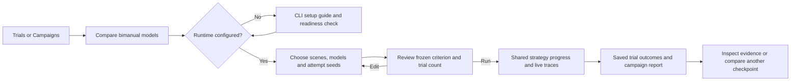

# ABC bimanual comparison journey

## Persona and goal

The robotics developer wants to compare ABC-VLA and an adapted π0.5 on the same
two-arm task, inspect failures, and decide which checkpoint to improve. The
evaluation operator prepares the GPU runtime and checkpoints. These roles may be
the same person. Both need a repeatable CLI path as well as a desktop browser.

## Starting point

ROVE already records trials and campaigns. The ordinary image-based trial form
does not describe a simulator episode, a scene reset seed, or an adapted action
interface. Reusing that form without showing these distinctions would suggest
that one image and one action chunk establish task completion.

## Journey

The initial page keeps task, model selection, success explanation and trial count
visible together. Review is a separate explicit gate. Selecting a model or seed
never starts inference. Changing configuration invalidates review.

A standalone comparison uses one scene seed and one model seed. Each model
creates an ordinary saved trial. A campaign repeats the same scene cases with
the selected model seeds and creates the existing campaign report. No separate
result database is introduced.

## What the user can distinguish

- A scene seed chooses a fixed starting condition. A model seed identifies a
  repeated attempt on that case.
- A strategy identifies a model checkpoint and its preprocessing. The simulator
  and action budget are shared.
- Execution progress reports completed work. The simulator's configured task
  criterion determines the outcome separately.
- A missing assessment is displayed as **Not assessed**, never as failed robot
  performance.
- Inspecting a trial opens its existing trace view in another tab so the
  comparison progress stays available.

## Recovery

Missing setup shows the operator's CLI path and setup guide. Unavailable models
remain visible with their reason and cannot be selected. A changed profile
requires a new review before launch. A reload can restore live campaign or trial
job progress through its URL; after a server restart, durable standalone trials
remain in the ordinary Trials browser even if the transient job is gone.

Stopping a comparison awaits cancellation of the existing execution task.
Recorded evidence is preserved. Leaving an edited, unrun comparison warns that
the draft has not been saved.
