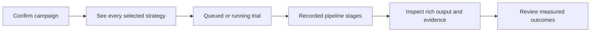

# Campaign execution progress

The robotics developer has selected observations and tasks, chosen one or more strategies, and confirmed success criteria. After starting the campaign, they need to know which strategy is executing, what it is doing, and when results are ready to inspect.

Run presents one lane per frozen strategy, with a readable name, execution state, finished/total trial count, and queued or unexecuted count. A running lane shows the current case, repetition, elapsed time, and actual recorded pipeline stages. Completed lanes retain the latest trial for inspection. Each lane has an Inspect output button that opens the existing detailed pipeline viewer; it does not launch a new trial.

The lane is execution feedback. A completed trial is not automatically a successful robot task. Success assessment remains in the campaign results, linked to scoring criteria and evidence.

No stage is inferred merely because an endpoint exists in the strategy. Adapter-internal perception and simulator reset spans remain in the trace, rather than becoming phantom pipeline stages. Missing events are identified as unavailable; a cancelled campaign labels remaining trials as not run.

The current trial row exists before its worker starts, so Run uses existing campaign assessments and incremental trial events without a second execution or scheduling system. Progress polling pauses when the document is hidden or the Run step is left. Inspect buttons retain focus across polling updates.
