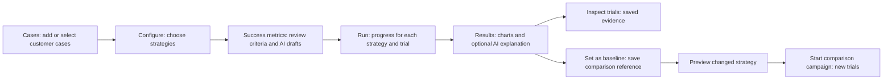

# User journey: campaign workspace

**Status:** Five-stage workspace implemented and checked with a six-trial local mock campaign and a narrow Results layout. Live AI and hardware validation excluded.

The current journey and persona requirements are maintained in the
[campaign workspace specification](../product/user-journey.md). This replaces the
older dashboard-first navigation priority while retaining saved evaluation records.

## Current state and customer feedback

The ML engineer sees a large dropdown instead of recognizable image/task cases,
unclear campaign links, contract fields without context, and no visible connection
between pipeline progress and trial identity. The researcher cannot easily tell which
saved evidence supports the result. Settings and optional chat interrupt task setup.
The user reported confusion and frustration rather than confidence in the evaluation.

## Revised journey

Reduce friction by reusing the gallery, retaining selected cards and drafts, placing
assistant configuration after case intake, and naming the case/strategy/attempt during
execution. Keep Settings as a separate utility. Preserve a single route from each
summary to the exact supporting trial and back. Use **Create a campaign** for creation,
**Run campaign** for execution and **Review results** for reading evidence. Make **Set
as baseline** a primary result action, with a badge only after saving the reference.
Keep version management in details and new execution behind **Start comparison campaign**.

## Acceptance

Measure completion of the full journey with isolated mock trials, not only navigation
assertions. Verify the user can identify what will run, what counts as a trial and what
evidence supports success before accepting the redesign. The detailed acceptance list
and actual delivery evidence belong in the canonical specification above.

## Assessment and results refinement

A separate Success metrics stage gives the engineer a clear moment to agree expected
outcomes and the evidence needed to judge them. AI drafts are proposals for review,
not expert ratings. Results answers the researcher's immediate comparison question
with per-strategy outcome and reliability charts before presenting optional explanatory
prose. Trial evidence, measurements and grading remain available behind **Inspect trials**.
Show unknown outcomes explicitly; unavailable evidence must not become a confident score.
The platform persona can keep using the same configured strategies and assistant runtime.

Acceptance requires five-stage keyboard/navigation behavior, per-strategy progress,
chart/count consistency and usable reports with the assistant unavailable. Verification
of this refinement includes a six-trial mock campaign with all unassessed outcomes
correctly retained and a 390px Results view without horizontal overflow. Earlier gallery
checks remain separate evidence. Generation behavior has fake-runtime coverage; live
AI generation was not tested.

## Trial-first entry and Improve loop

The latest user correction makes chat the first experience: select the model/pipeline,
provide task, image and optional URDF, then inspect saved trial results. **Add to
campaign** carries those inputs into case/strategy selection. The customer reviews
three to five editable criteria, confirms execution and arrives automatically at
Results after completion. From the campaign browser, **Improve** opens a populated
workflow with recommendations visible on its first page.

Preserve the original trial as an exploratory reference, never an extra campaign
attempt. Name the baseline's reference strategy explicitly when several were tested.
Adding cases expands coverage and changes comparison conditions; missing judgments
need review before they motivate model changes. The [latest journey](../product/user-journey.md#latest-entry-try-a-task-then-build-a-campaign)
and [ADR-027](../architecture/ADR-027-trial-to-campaign-improvement.md) define the implemented flow and local handoff/asset/strategy regression coverage.
The full loop is now browser-verified with a retained Panda URDF, three editable
template criteria, automatic Results, a saved baseline and a repeat Improve campaign.
The exact reference matched with zero component changes and pending expert outcomes.
Cases and criterion editing showed no horizontal overflow at 390px. This mock-only
check does not establish model improvement, live AI quality or hardware performance.
Earlier six-trial browser evidence remains a separate campaign-workspace check.
