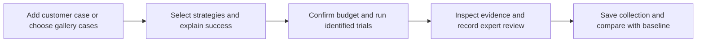

# User journey: campaign workspace

**Status:** Implemented with local regression coverage and desktop mock journey verification; 390px gallery verified in light and dark themes.

The current journey and persona requirements are maintained in the
[campaign workspace specification](../product/user-journey.md). This replaces the
older dashboard-first navigation priority while retaining saved evaluation records.

## Current state and customer feedback

The ML engineer sees a large dropdown instead of recognizable image/task cases,
unclear campaign links, contract fields without context, and no visible connection
between pipeline progress and trial identity. The researcher cannot easily tell which
saved evidence supports the result. Settings and optional chat interrupt task setup.
The user reported confusion and frustration rather than confidence in the evaluation.

## Revised journey

Reduce friction by reusing the gallery, retaining selected cards and drafts, placing
assistant configuration after case intake, and naming the case/strategy/attempt during
execution. Keep Settings as a separate utility. Preserve a single route from each
summary to the exact supporting trial and back.

## Acceptance

Measure completion of the full journey with isolated mock trials, not only navigation
assertions. Verify the user can identify what will run, what counts as a trial and what
evidence supports success before accepting the redesign. The detailed acceptance list
and actual delivery evidence belong in the canonical specification above.
