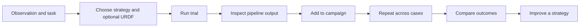

# User journey: trial first

## Persona and goal

A robotics developer has an observation, task, and a model pipeline or agent to evaluate. Their first goal is to see what it does on that task. They should be able to discover repeatable evaluations after inspecting a concrete result.

## Previous friction

The landing page prioritized campaign setup. Developers encountered cases, success rules, and repeat settings before seeing their first pipeline output. The original trial composer was secondary, and completed outputs did not clearly lead into campaigns.

## Journey

The landing page makes Run a trial the primary action. Evaluate opens the existing composer with image, instruction, strategy selection and optional robot description. The existing stage renderer and execution flow remain in use.

After the server confirms a saved trial, Add to campaign carries its durable trial ID into campaign setup. For multiple strategies, each action names the correct strategy and identifies its own trial. The action never starts another evaluation by itself. Failed execution and missing persistence identity do not create a misleading reuse link.

Campaigns is the collection of saved evaluations. Review results opens its existing evidence view. Improve starts from the exact completed campaign through a separate route; running campaigns retain their live execution controls.
